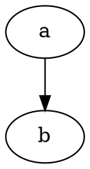
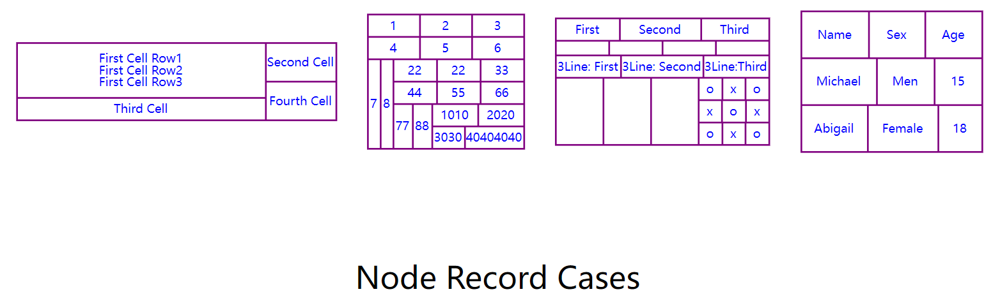
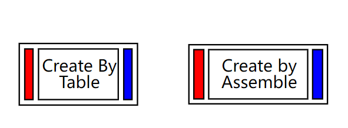
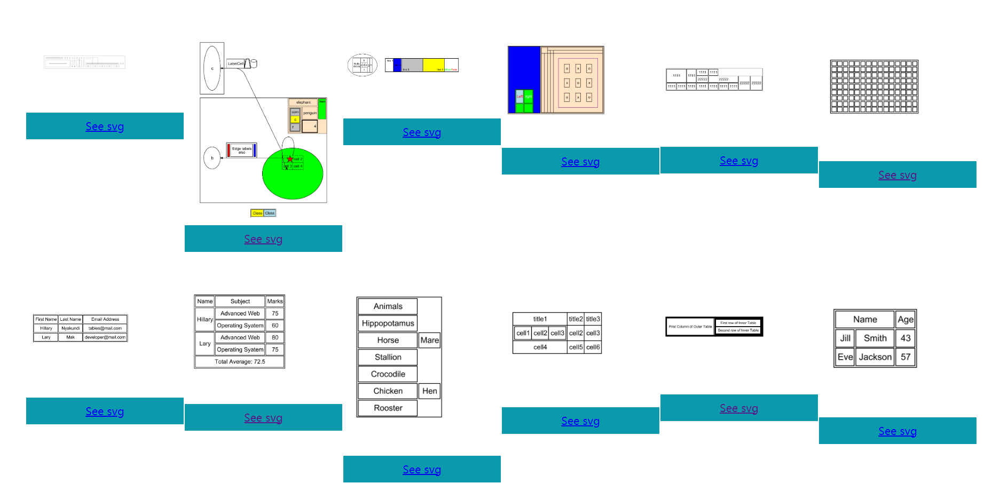
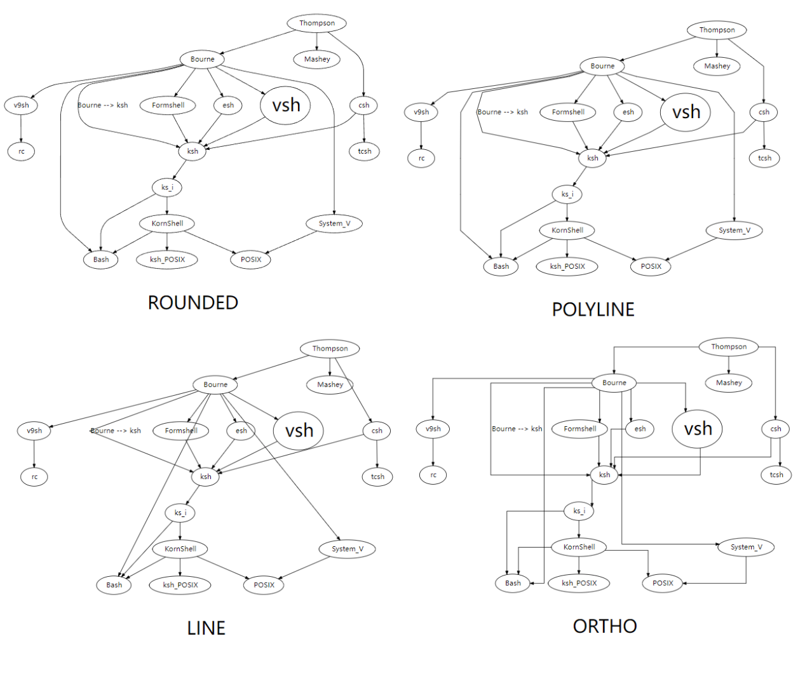
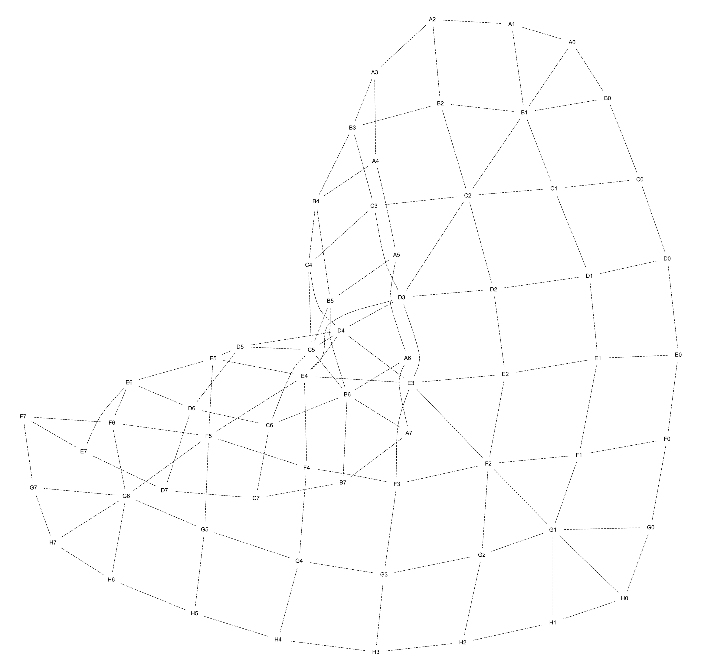
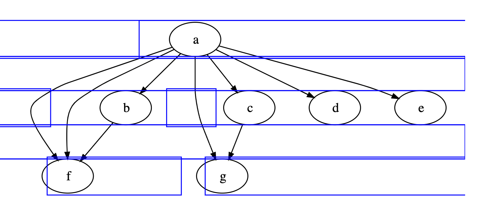
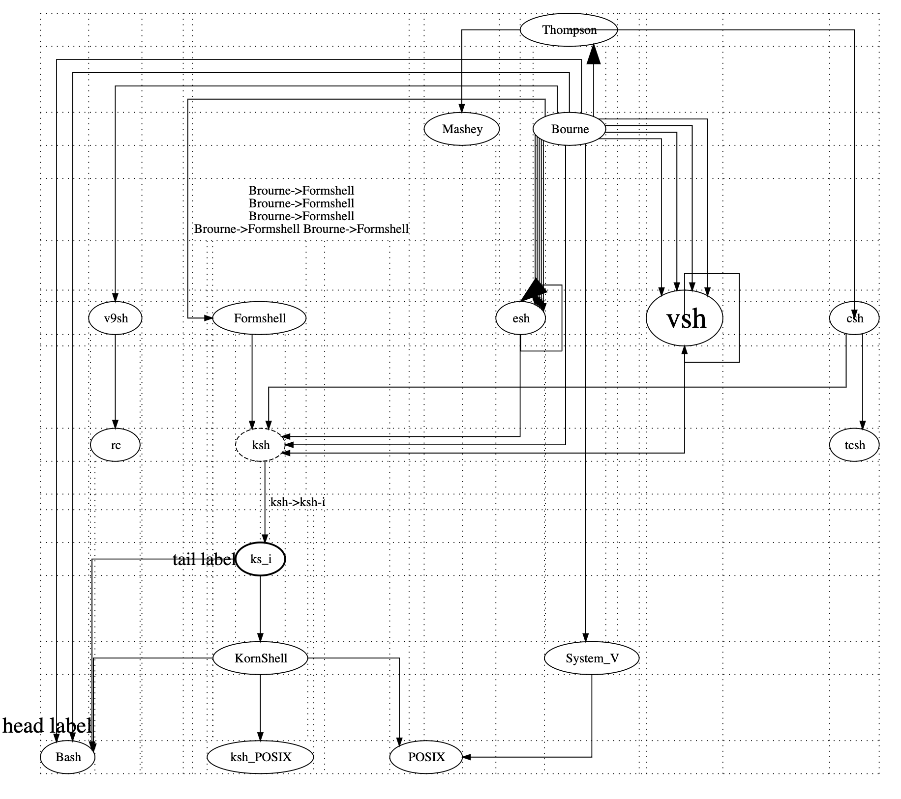

# graph-support

**graph-support** is a lightweight Java re-implementation of [Graphviz](https://graphviz.org/) for parsing and rendering DOT graphs.

## Using by CLI

Download the latest version from here:

prepare a dot-script file:



Render by CLI

```shell
java -jar graph-support-cli.jar example.dot -o example -Tpng
```

See help

```shell
java -jar graph-support-cli.jar -h
```

## Using in code

### Render by Java API

Import core dependency, if no need dot parser, import this dependency is enough

```xml
<dependency>
    <groupId>org.graphper</groupId>
    <artifactId>graph-support-core</artifactId>
    <version>1.5.0</version>
</dependency>
```

An API with a structure like a dot script, if you have written dot, it is easy to think of how to convert it into the corresponding java code:

```java
// Node definition
Node nd_1 = Node.builder().label("Node 1").build();
Node nd_2 = Node.builder().label("Node 2").build();
Node nd_3_a = Node.builder().label("Above Right Node 3").build();
Node nd_3_l = Node.builder().label("Left of Node 3").build();
Node nd_3 = Node.builder().label("Node 3").build();
Node nd_3_r = Node.builder().label("Right of Node 3").build();
Node nd_4 = Node.builder().label("Node 4").build();

Graphviz graphviz = Graphviz.digraph()
    // Node attribute template
    .tempNode(Node.builder().shape(NodeShapeEnum.RECT).build())
    // Edges in root graph
    .addLine(nd_3_a, nd_3_r)
    .addLine(nd_1, nd_2, nd_3, nd_4)
    // Use Cluster to wrap the corresponding nodes and edges
    .cluster(
        Cluster.builder()
            // Edge attribute template
            .tempLine(Line.tempLine().color(Color.GREY).arrowHead(ArrowShape.NONE).build())
            // Use Subgraph to limit nodes to the same level
            .subgraph(
                Subgraph.builder()
                    .rank(Rank.SAME)
                    .addNode(nd_3_l, nd_3, nd_3_r)
                    .build()
            )
            // Edges in cluster
            .addLine(nd_3_l, nd_3, nd_3_r)
            .build()
    )
    .build();

// Save png
graphviz.toFile(FileType.PNG).save("./", "example");
```

### Render by dot script

Import DOT module:

```xml
<dependency>
    <groupId>org.graphper</groupId>
    <artifactId>graph-support-dot</artifactId>
    <version>1.5.0</version>
</dependency>
```

Render by dot-script:

```java
String dot = "digraph {a -> b}";
DotParser.parse(dot).toFile(FileType.PNG).save("./", "example");
```


no need change code

```java
// Output PNG only relys on java.awt and android.graphics
graphviz.toFile(FileType.PNG);

// Output TIFF success because have batik in runtime
graphviz.toFile(FileType.TIFF);

// Output PDF without FOP will throws FailInitResourceException
graphviz.toFile(FileType.PDF);
```

import **fop** dependencies via maven

```xml
<dependency>
    <groupId>org.apache.xmlgraphics</groupId>
    <artifactId>batik-codec</artifactId>
    <version>1.9</version>
</dependency>
<dependency>
    <groupId>org.apache.xmlgraphics</groupId>
    <artifactId>batik-transcoder</artifactId>
    <version>1.9</version>
</dependency>
<dependency>
    <groupId>org.apache.xmlgraphics</groupId>
    <artifactId>fop</artifactId>
    <version>2.4</version>
</dependency>
```

same code as above

```java
// Output PNG only relys on java.awt and android.graphics
graphviz.toFile(FileType.PNG);

// Output TIFF success because have batik in runtime
graphviz.toFile(FileType.TIFF);

// Output PDF success because have fop in runtime
graphviz.toFile(FileType.PDF);
```

### Node shape example


### Record node example

```java
Node a = Node.builder().label("{{Name|Sex|Age}|{Michael|Men|15}|{Abigail|Female|18}}")
    .margin(0.5)
    .build();
Node b = Node.builder().label(
    "{{1|2|3}|{4|5|6}|{7|8|{{22|22|33}|{44|55|66}|{77|88|{{1010|2020}|{3030|40404040}}}}}}")
    .build();
Node c = Node.builder().label(
    "{First Cell Row1\nFirst Cell Row2\nFirst Cell Row3|Third Cell}|{Second Cell|Fourth Cell}")
    .build();
Node d = Node.builder().label(
    "{{First|Second|Third}|{|||}|{3Line: First|3Line: Second|3Line:Third}|{|||{{o|x|o}|{x|o|x}|{o|x|o}}}}")
    .build();

Graphviz graphviz = Graphviz.digraph()
    .label("Node Record Cases")
    .tempNode(
        Node.builder()
        .shape(NodeShapeEnum.RECORD)
        .color(Color.PURPLE)
        .fontColor(Color.BLUE)
        .style(NodeStyle.BOLD)
        .build()
	)
    .addNode(a, b, c, d)
    .build();
```



### Table and Assemble

**Table** provides the html table layout of Cells, and **Assemble** is an original way of splicing Cells. Here is an example of drawing the same graph using both methods:

```java
    Node table = Node.builder()
        .table(
            table().cellSpacing(4)
                .tr(
                    td().bgColor(Color.RED),
                    td().text("Create By\nTable"),
                    td().bgColor(Color.BLUE)
                )
        )
        .build();

    Node assemble = Node.builder()
        .assemble(
            Assemble.builder()
                .width(1.6)
                .height(0.6)
        		// Left Cell
                .addCell(0.05, 0.05,// Offset
                         Node.builder()
                             .width(0.1)
                             .height(0.5)
                             .fillColor(Color.RED)
                             .build())
        		// Middle cell
                .addCell(0.2, 0.05,// Offset
                         Node.builder()
                             .width(1)
                             .height(0.5)
                             .fontSize(12)
                             .label("Create by \nAssemble")
                             .build())
        		// Right cell
                .addCell(1.25, 0.05,// Offset
                         Node.builder()
                             .width(0.1)
                             .height(0.5)
                             .fillColor(Color.BLUE)
                             .build())
                .addCell(0, 0,
                         Node.builder()
                             .width(1.4)
                             .height(0.6)
                             .build())
                .build()
        )
        .build();

    Graphviz.digraph()
        .tempNode(Node.builder().shape(NodeShapeEnum.PLAIN).build())
        .addNode(table, assemble)
        .build();
```



*Some table example:*




### Edge router example



### Fdp layout



### Edge router debug attribute

Some properties can be used to debug edge router:

#### Show control points


#### Show edge router boxes



#### Show grid in ORTHO



### Edge Port


### Use layout engine

If you only want to use the layout engine to calculate the coordinates of nodes and the position of line segments, the following is a simple example:

```java
Node a = Node.builder().label("a").build();
Node b = Node.builder().label("b").build();
Graphviz graphviz = Graphviz.digraph()
    .addLine(a, b)
    .build();

// Use the layout engine directly, skip graph rendering
DrawGraph drawGraph = Layout.DOT.getLayoutEngine().layout(graphviz);

for (NodeDrawProp node : drawGraph.nodes()) {
  // The node coordinate
  double x = node.getX();
  double y = node.getX();

  // Set the coordinates into your own program
}

for (LineDrawProp line : drawGraph.lines()) {
  // all points of the line segment
  for (FlatPoint point : line) {
    // If the line is a curve, every group of four points forms a two-stage Bezier curve, 
    // and every two adjacent Bezier curves share one point
    if (line.isBesselCurve()) {
    } else {
    }
  }
}

```

## Contributing

We welcome all developers to contribute to the project. If you're interested in contributing code, here are some areas where we'd love to do more work:

- Add more node and arrow shapes to the library;
- Implement basic styling for additional elements in the graph;
- Build a dot script parser that maps to the graph-support API;
- Create new line routing or node layout algorithms to enhance the library.

Please feel free to contribute in any way you feel comfortable, and thank you for your interest in our project!
