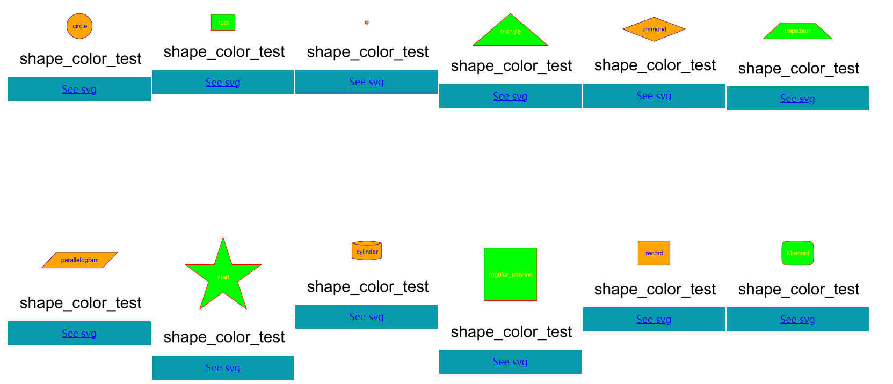

# graph-support

[](https://adoptium.net/)
[](https://maven.apache.org/)
[](LICENSE)

> A lightweight Java re-implementation of [Graphviz](https://graphviz.org/) for **parsing**, **layout**, and **rendering** graphs.

## ✨ Features

- 🚀 **Lightweight & Self-Contained** - No external dependencies, no Graphviz binaries required
- 🔄 **Dual API Support** - Use Java API or DOT script, whichever fits your workflow
- 🌍 **Cross-Platform** - Works on Mac, Linux, Windows, and Android
- ⚡ **High Performance** - Advanced DOT layout engines (DOT, DOTQ) for optimal graph positioning
- 🎯 **Easy Integration** - Perfect for embedding into Java applications

## 🚀 Quick Start

### Prerequisites

- **Java 8+** ([OpenJDK](https://adoptium.net/) recommended)
- **Maven 3.6+** ([Download here](https://maven.apache.org/))

### Installation

Add to your `pom.xml`:

```xml
<!-- Core functionality (Java API only) -->
<dependency>
    <groupId>org.graphper</groupId>
    <artifactId>graph-support-core</artifactId>
    <version>1.5.2</version>
</dependency>

<!-- DOT parsing support -->
<dependency>
    <groupId>org.graphper</groupId>
    <artifactId>graph-support-dot</artifactId>
    <version>1.5.2</version>
</dependency>
```

### Your First Graph

```java
import org.graphper.api.Graphviz;
import org.graphper.api.Node;
import org.graphper.api.FileType;

public class HelloGraph {
    public static void main(String[] args) {
        // Create nodes
        Node a = Node.builder().label("Hello").build();
        Node b = Node.builder().label("World").build();
        
        // Create graph
        Graphviz graph = Graphviz.digraph()
            .addLine(a, b)
            .build();
        
        // Save as PNG
        try {
            graph.toFile(FileType.PNG).save("./", "hello-world");
            System.out.println("✅ Graph saved as 'hello-world.png'");
        } catch (Exception e) {
            e.printStackTrace();
        }
    }
}
```

## 📚 Documentation

- 📖 **[Complete Documentation](./docs)** - Detailed API reference and examples
- 🎯 **[Release Notes](https://github.com/jamisonjiang/graph-support/releases)** - Latest updates and changes
- 🐛 **[Issue Tracker](https://github.com/jamisonjiang/graph-support/issues)** - Report bugs or request features

## 📖 Usage Examples

### 1. Java API (Recommended for Programmatic Graphs)

Perfect when you want to build graphs programmatically:

```java
import java.io.IOException;
import org.graphper.api.Graphviz;
import org.graphper.api.Node;
import org.graphper.api.Line;
import org.graphper.api.FileType;
import org.graphper.api.attributes.Color;
import org.graphper.api.attributes.NodeShapeEnum;
import org.graphper.draw.ExecuteException;

public class AdvancedExample {
  public static void main(String[] args) throws ExecuteException, IOException {
    // Create nodes with custom styling
    Node start = Node.builder()
        .label("Start")
        .shape(NodeShapeEnum.CIRCLE)
        .color(Color.GREEN)
        .build();

    Node process = Node.builder()
        .label("Process")
        .shape(NodeShapeEnum.RECT)
        .build();

    Node end = Node.builder()
        .label("End")
        .shape(NodeShapeEnum.TRAPEZIUM)
        .color(Color.RED)
        .build();

    // Build graph with custom edge styling
    Graphviz graph = Graphviz.digraph()
        .tempNode(Node.builder().fontSize(14).build()) // Default node style
        .addLine(start, process, end)
        .tempLine(Line.tempLine().color(Color.BLUE).penWidth(2).build()) // Default edge style
        .build();

    // Export
    graph.toFile(FileType.PNG).save("./", "workflow");
  }
}
```

### 2. DOT Script Parsing

Great for existing DOT files or when you prefer the DOT syntax:

```java
import java.io.IOException;
import org.graphper.api.Graphviz;
import org.graphper.api.FileType;
import org.graphper.draw.ExecuteException;
import org.graphper.parser.DotParser;

public class DotExample {
  public static void main(String[] args) throws ExecuteException, IOException {
    String dotScript = "digraph workflow {\n" +
        "    start [shape=oval, color=green];\n" +
        "    process [shape=rect];\n" +
        "    end [shape=oval, color=red];\n" +
        "    \n" +
        "    start -> process -> end;\n" +
        "}";

    Graphviz graph = DotParser.parse(dotScript);
    graph.toFile(FileType.PNG).save("./", "workflow-from-dot");
  }
}
```

### 3. Command Line Interface

For quick rendering without writing code:

```bash
# Download the CLI JAR from [releases](https://github.com/jamisonjiang/graph-support/releases)

# Render from DOT file
java -jar graph-support-cli.jar input.dot -o output -Tpng

# Render from DOT string
java -jar graph-support-cli.jar -s "digraph {a->b->c}" -o test -Tpng

# Get help
java -jar graph-support-cli.jar -h
```

## 🎨 Advanced Features

### Layout Engine Only (Coordinates without Images)

Get node positions and edge paths for custom rendering:

```java
import org.graphper.api.Graphviz;
import org.graphper.api.Node;
import org.graphper.api.attributes.Layout;
import org.graphper.draw.DrawGraph;
import org.graphper.draw.ExecuteException;
import org.graphper.draw.LineDrawProp;
import org.graphper.draw.NodeDrawProp;

public class LayoutOnlyExample {
  public static void main(String[] args) throws ExecuteException {
    Node a = Node.builder().label("A").build();
    Node b = Node.builder().label("B").build();

    Graphviz graph = Graphviz.digraph()
        .addLine(a, b)
        .build();

    // Get layout without rendering
    DrawGraph layout = Layout.DOT.getLayoutEngine().layout(graph);

    // Access coordinates
    for (NodeDrawProp node : layout.nodes()) {
      System.out.printf("Node %s: (%.2f, %.2f)%n",
                        node.getNode().nodeAttrs().getLabel(), node.getX(), node.getY());
    }

    // Access edge paths
    for (LineDrawProp line : layout.lines()) {
      if (line.isBesselCurve()) {
        // Handle Bezier curves
        System.out.println("Bezier curve with control points");
      } else {
        // Handle polyline
        System.out.println("Simple polyline");
      }
    }
  }
}
```

### Clustering and Subgraphs

Organize complex graphs with clusters and rank constraints:

```java
import org.graphper.api.*;
import org.graphper.api.attributes.Color;
import org.graphper.api.attributes.NodeShapeEnum;
import org.graphper.api.attributes.Rank;
import org.graphper.api.attributes.ArrowShape;
import org.graphper.draw.ExecuteException;
import java.io.IOException;

public class ClusteringExample {
  public static void main(String[] args) throws ExecuteException, IOException {
    // Create nodes
    Node input = Node.builder().label("Input").shape(NodeShapeEnum.ELLIPSE).build();
    Node process1 = Node.builder().label("Process 1").shape(NodeShapeEnum.RECT).build();
    Node process2 = Node.builder().label("Process 2").shape(NodeShapeEnum.RECT).build();
    Node output = Node.builder().label("Output").shape(NodeShapeEnum.ELLIPSE).build();

    // Create cluster with subgraph for parallel processing
    Graphviz graph = Graphviz.digraph()
        .addLine(input, process1)
        .addLine(input, process2)
        .cluster(
            Cluster.builder()
                .tempLine(Line.tempLine().color(Color.GREY).arrowHead(ArrowShape.NONE).build())
                .subgraph(
                    Subgraph.builder()
                        .rank(Rank.SAME) // Keep nodes on same level
                        .addNode(process1, process2)
                        .build()
                )
                .addLine(process1, output)
                .addLine(process2, output)
                .build()
        )
        .build();

    // Export
    graph.toFile(FileType.PNG).save("./", "clustering-example");
  }
}
```

## 🖼️ Visual Examples

### Basic Node Types



### Rich Content


### Layout & Routing


### Debug Features


## 🔧 Building from Source

```bash
git clone https://github.com/jamisonjiang/graph-support.git
cd graph-support
mvn clean install
```

## 🤝 Contributing

We welcome contributions! Here are some areas where you can help:

- 🎨 **New Node/Arrow Shapes** - Extend the visual capabilities
- 🎨 **Styling Options** - Add more customization possibilities  
- 🧮 **Layout Algorithms** - Improve or add new layout engines
- 📚 **Documentation** - Help improve examples and guides
- 🐛 **Bug Fixes** - Help squash bugs and improve stability


## 📄 License

This project is licensed under the MIT License - see the [LICENSE](LICENSE) file for details.