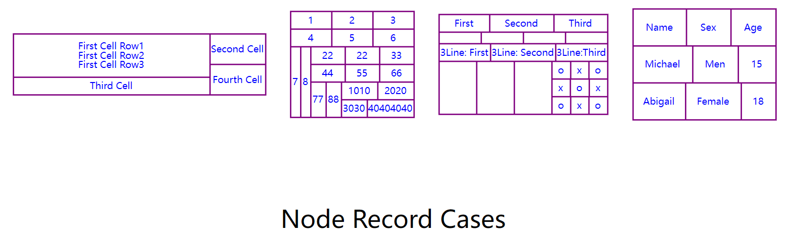
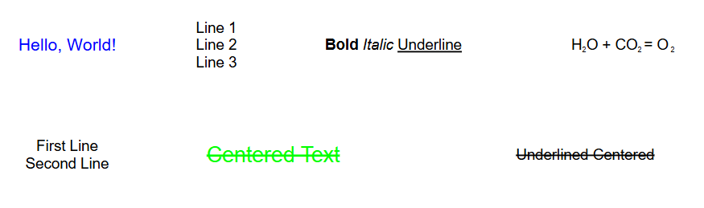
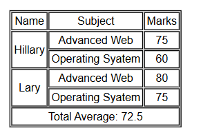
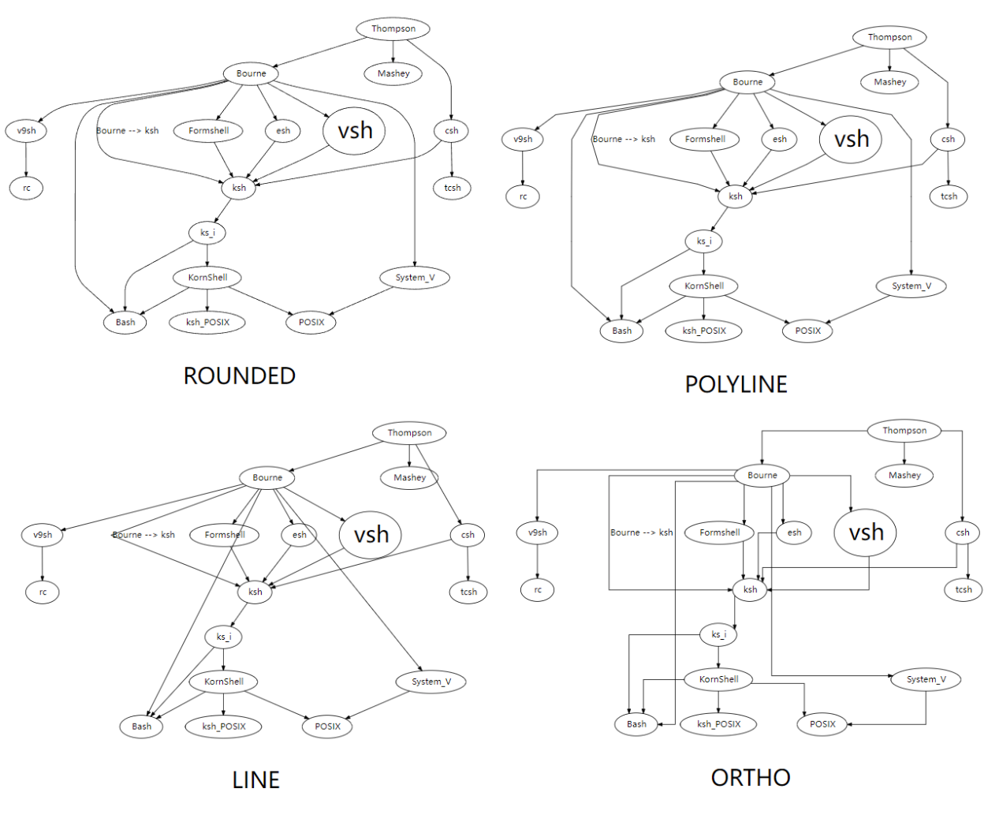
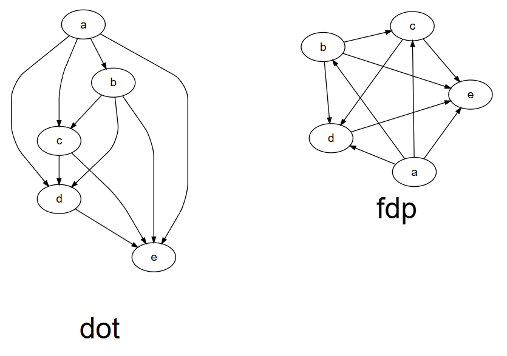
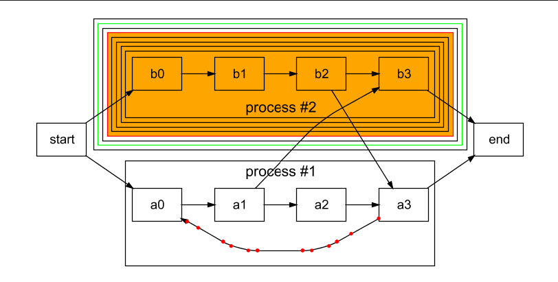
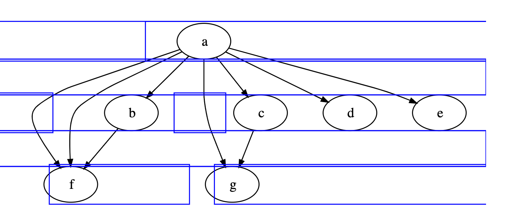
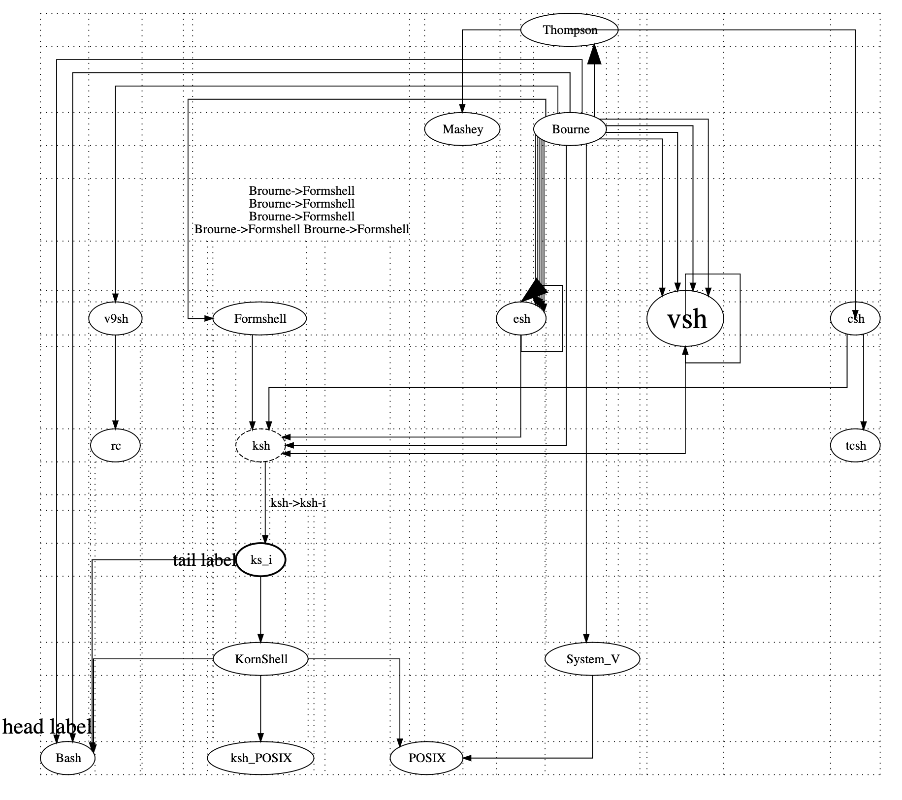
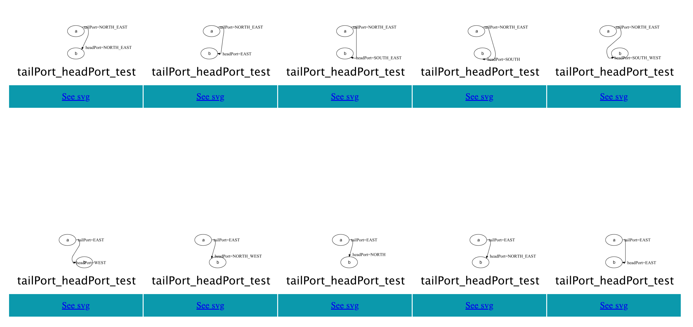

# graph-support

**graph-support** is a lightweight Java re-implementation of [Graphviz](https://graphviz.org/) for **parsing**, **rendering**, and **layout** of DOT graphs. It supports both a **CLI** tool and an **API** library for embedding into Java applications.

------

## Features

- **Pure Java API**  for building graph.
- **DOT Script Parsing**: Parsing`.dot` files or strings and generate graph.
- **Flexible Layout Engines**: Multiple engines (e.g., `dot`, `fdp`) for different layout styles.
- **Clusters & Subgraphs**: Organize your nodes logically or visually.
- **HTML Label Support**: Render rich labels with HTML-like syntax.
- **CLI Tool**: Quickly transform `.dot` files to PNG, SVG, etc., in your shell.

------

## Using by CLI

1. **Download** the latest CLI JAR (e.g., `graph-support-cli.jar`).

2. Prepare a DOT file

   ```dot
   digraph { a -> b }
   ```

3. Render

   ```shell
   java -jar graph-support-cli.jar example.dot -o example -Tpng
   ```

4. Help

   ```shell
   java -jar graph-support-cli.jar -h
   ```

   Shows usage and options.

------

## Using in Code

### Render by Java API

If you **do not need** DOT parsing, only the Core is required:

```xml
<dependency>
    <groupId>org.graphper</groupId>
    <artifactId>graph-support-core</artifactId>
    <version>1.5.0</version>
</dependency>
```

#### Example

```java
public class Example {
    public static void main(String[] args) {
        // Node definition
        Node nd_1 = Node.builder().label("Node 1").build();
        Node nd_2 = Node.builder().label("Node 2").build();
        Node nd_3_a = Node.builder().label("Above Right Node 3").build();
        Node nd_3_l = Node.builder().label("Left of Node 3").build();
        Node nd_3 = Node.builder().label("Node 3").build();
        Node nd_3_r = Node.builder().label("Right of Node 3").build();
        Node nd_4 = Node.builder().label("Node 4").build();

        Graphviz graphviz = Graphviz.digraph()
            // Node attribute template
            .tempNode(Node.builder().shape(NodeShapeEnum.RECT).build())
            // Edges in root graph
            .addLine(nd_3_a, nd_3_r)
            .addLine(nd_1, nd_2, nd_3, nd_4)
            // Use Cluster to wrap the corresponding nodes and edges
            .cluster(
                Cluster.builder()
                    // Edge attribute template
                    .tempLine(Line.tempLine().color(Color.GREY).arrowHead(ArrowShape.NONE).build())
                    // Use Subgraph to keep certain nodes on the same rank
                    .subgraph(
                        Subgraph.builder()
                            .rank(Rank.SAME)
                            .addNode(nd_3_l, nd_3, nd_3_r)
                            .build()
                    )
                    .addLine(nd_3_l, nd_3, nd_3_r)
                    .build()
            )
            .build();

        // Save PNG
        try {
            graphviz.toFile(FileType.PNG).save("./", "example");
            System.out.println("Saved 'example.png'");
        } catch (Exception e) {
            e.printStackTrace();
        }
    }
}
```

### Render by Dot Script

If you want to **parse** a `.dot` string or file, import the DOT module:

```xml
<dependency>
    <groupId>org.graphper</groupId>
    <artifactId>graph-support-dot</artifactId>
    <version>1.5.0</version>
</dependency>
```

Then:

```java
import org.graphper.dot.DotParser;

public class DotExample {
    public static void main(String[] args) {
        String dot = "digraph { a -> b }";

        Graphviz graphviz = DotParser.parse(dot);
        try {
            graphviz.toFile(FileType.PNG).save("./", "example");
            System.out.println("Saved 'example.png'");
        } catch (Exception e) {
            e.printStackTrace();
        }
    }
}
```

------

## Examples

### Record node



### HTML Lable



### HTML Table



### Edge router



### Layout



### Edge Router Debug

Some properties can be used to debug how edges are routed:

#### Show control points



#### Show edge router boxes



#### Show GRID in ORTHO



### Edge Port



------

## Layout Engine Only (Advanced)

If you want **only** the layout engine to compute node coordinates or line segments (without generating images), you can do:

```
java复制编辑Node a = Node.builder().label("a").build();
Node b = Node.builder().label("b").build();

Graphviz graphviz = Graphviz.digraph()
    .addLine(a, b)
    .build();

// Use the layout engine directly; skip rendering
DrawGraph drawGraph = Layout.DOT.getLayoutEngine().layout(graphviz);

for (NodeDrawProp node : drawGraph.nodes()) {
  double x = node.getX();
  double y = node.getY();
  // Integrate these coordinates in your custom GUI or app
}

for (LineDrawProp line : drawGraph.lines()) {
  // Each line can have multiple segments or Bezier curves
  if (line.isBesselCurve()) {
    // interpret sets of 4 control points
  } else {
    // a simple polyline
  }
}
```

------

## Contributing

We welcome developers to contribute new features, bug fixes, or improvements! Some areas we’d love help with:

- More node/arrow shapes
- Additional styling options
- New line-routing or layout algorithms

Simply **fork** the repo, create a feature branch, and open a Pull Request. Thank you for your interest in **graph-support**!