# graph-support

[](https://adoptium.net/)
[](https://maven.apache.org/)
[](https://github.com/jamisonjiang/graph-support/releases)
[](LICENSE)

graph-support is a Java graph layout and visualization library. Build graphs with a fluent API or
parse DOT source, calculate their layout, and render diagrams without a native Graphviz installation.

It can be used as a Java library, a DOT parser, a command-line renderer, or a desktop DOT editor.

## Capabilities

- Build graphs with a fluent Java API or parse existing DOT source
- Hierarchical and force-directed layout engines for a range of graph topologies
- Rich graph modeling with subgraphs, clusters, ports, labels, tables, and record nodes
- Flexible edge routing with configurable paths, endpoints, labels, and arrow shapes
- Vector, raster, and document output, including SVG, PNG, JPEG, TIFF, GIF, and PDF
- Layout-only geometry access for applications that provide their own rendering pipeline
- Command-line rendering and an interactive desktop DOT editor

## Quick Start

Current version: **1.5.4**.

For graphs created with the Java API:

```xml
<dependency>
  <groupId>org.graphper</groupId>
  <artifactId>graph-support-core</artifactId>
  <version>1.5.4</version>
</dependency>
```

For applications that parse DOT source:

```xml
<dependency>
  <groupId>org.graphper</groupId>
  <artifactId>graph-support-dot</artifactId>
  <version>1.5.4</version>
</dependency>
```

Requirements:

- Java 8 or newer
- Maven 3.6 or newer when building from source

### Build a Graph in Java

Create a workflow and export it as SVG:

```java
import java.io.IOException;
import org.graphper.api.FileType;
import org.graphper.api.Graphviz;
import org.graphper.api.Line;
import org.graphper.api.Node;
import org.graphper.api.attributes.Color;
import org.graphper.api.attributes.NodeShapeEnum;
import org.graphper.api.attributes.Rankdir;
import org.graphper.draw.ExecuteException;

public class OrderWorkflow {

  public static void main(String[] args) throws ExecuteException, IOException {
    Node received = Node.builder()
        .label("Order received")
        .shape(NodeShapeEnum.CIRCLE)
        .color(Color.GREEN)
        .build();

    Node validate = Node.builder()
        .label("Validate order")
        .build();

    Node fulfilled = Node.builder()
        .label("Fulfilled")
        .shape(NodeShapeEnum.CIRCLE)
        .color(Color.BLUE)
        .build();

    Graphviz graph = Graphviz.digraph()
        .rankdir(Rankdir.LR)
        .tempNode(Node.builder().shape(NodeShapeEnum.RECT).fontSize(14).build())
        .addLine(received, validate)
        .addLine(Line.builder(validate, fulfilled).label("approved").build())
        .build();

    graph.toFile(FileType.SVG).save("./", "order-workflow");
  }
}
```

Select other output formats through `FileType`. Core layout and SVG generation are independent of
optional raster and PDF backends; available formats depend on the runtime and rendering dependencies.
The CLI bundles Batik and FOP. TIFF additionally requires an ImageIO TIFF writer, which default
Java 8 runtimes do not provide.

External images require explicit permission. See [image configuration](docs/node/Image.md) and
[conversion security](docs/SVG%20Conversion%20Security.md) when using images or untrusted input.

## DOT and Rich Content

DOT input uses the same layout and rendering pipeline as the Java API. Clusters express groups,
while HTML-like labels support structured content such as tables, styled text, and links.

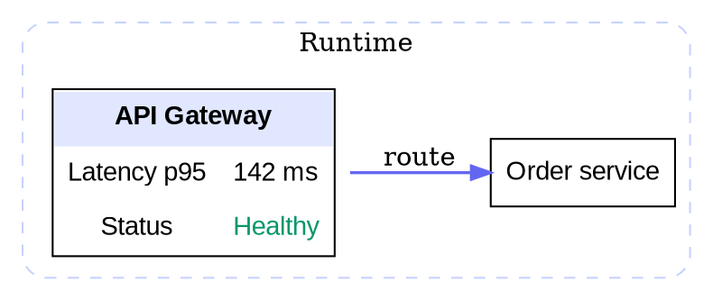
```dot
digraph ServiceHealth {
  graph [rankdir="LR"]
  node [shape="plaintext", fontname="Arial"]

  subgraph cluster_runtime {
    label="Runtime"
    color="#C7D2FE"
    style="rounded,dashed"

    gateway [label=<
      <TABLE BORDER="1" CELLBORDER="0" CELLSPACING="0" CELLPADDING="7">
        <TR><TD COLSPAN="2" BGCOLOR="#E0E7FF"><B>API Gateway</B></TD></TR>
        <TR><TD>Latency p95</TD><TD>142 ms</TD></TR>
        <TR><TD>Status</TD><TD><FONT COLOR="#059669">Healthy</FONT></TD></TR>
      </TABLE>
    >]
    orders [shape="box" label="Order service"]
  }

  gateway -> orders [label="route" color="#6366F1" penwidth="1.6"]
}
```

Parse DOT from Java:

```java
Graphviz graph = DotParser.parse(dotSource);
String svg = graph.toSvgStr();
```

Rich-label building blocks are also available from Java through `Html.table(...)`, `LabelTag`, and
record cells. Detailed references:

- [HTML tables](docs/Table.md)
- [Rich text and LabelTag](docs/LabelTag.md)
- [Record-shaped nodes](docs/node/RecordTag.md)

## Command Line

Download `graph-support-cli.jar` from
[GitHub Releases](https://github.com/jamisonjiang/graph-support/releases), or build it from source.

```bash
# DOT file to PNG
java -jar graph-support-cli.jar input.dot -o output -Tpng

# DOT string to SVG
java -jar graph-support-cli.jar -s "digraph { a -> b -> c }" -o graph -Tsvg

# Show all options
java -jar graph-support-cli.jar -h
```

## Desktop DOT Studio

The CLI JAR includes a desktop editor with live graph preview, syntax highlighting and completion,
error feedback, and SVG/PNG export. It uses graph-support's own layout engine and requires a
graphical desktop environment.

```bash
java -jar graph-support-cli.jar ui
```

## Layout and Rendering

Available layout engines:

| Layout | Best for |
| --- | --- |
| `DOT` | High-quality hierarchical directed graphs |
| `DOTQ` | Faster hierarchical layout for larger graphs |
| `FDP` | General force-directed graphs |
| `JFDP` | Force-directed layout with improved stability |
| `GFDP` | Dense graphs with localized force calculations |

For custom rendering, obtain the calculated draw model instead of an image:

```java
DrawGraph drawing = Layout.DOT.getLayoutEngine().layout(graph);

for (NodeDrawProp node : drawing.nodes()) {
  System.out.printf("x=%.2f y=%.2f%n", node.getX(), node.getY());
}
```

## Gallery

Examples of graph-support's layout and rendering capabilities (rendered with version 1.5.3):

<table>
  <tr>
    <td width="25%" valign="top">
      <strong>Shapes and styles</strong><br/>
      Shape geometry, fills, strokes, and rounded styles.<br/>
      <a href="docs/gallery/shapes-and-styles.png">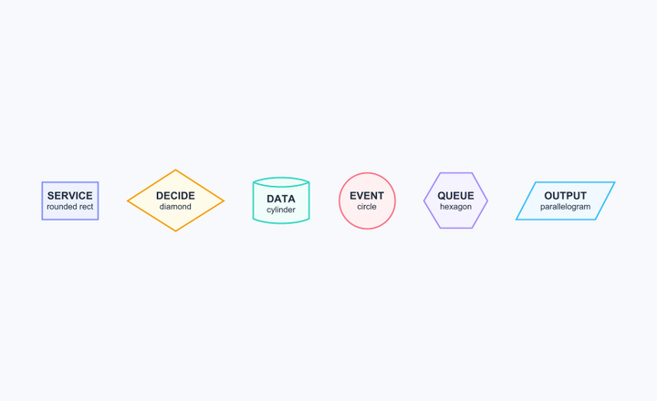</a>
    </td>
    <td width="25%" valign="top">
      <strong>Rich labels</strong><br/>
      Multiline text, font styling, decoration, subscript, and superscript.<br/>
      <a href="docs/gallery/rich-labels.png">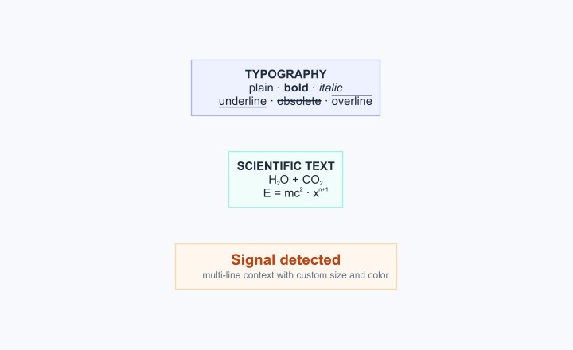</a>
    </td>
    <td width="25%" valign="top">
      <strong>HTML table dashboard</strong><br/>
      Rows, cells, column spans, backgrounds, alignment, and typography.<br/>
      <a href="docs/gallery/commerce-observatory.png">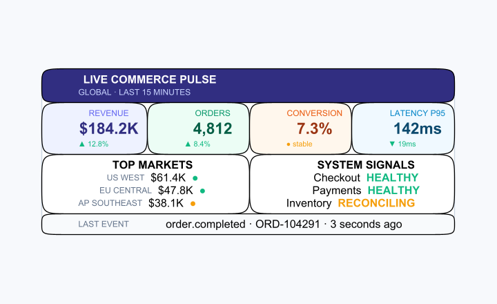</a>
    </td>
    <td width="25%" valign="top">
      <strong>Record cells and ports</strong><br/>
      Nested cells with edges anchored to named record ports.<br/>
      <a href="docs/gallery/record-ports.png">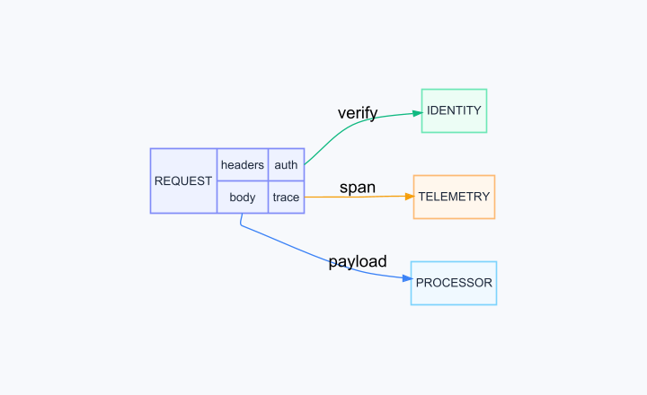</a>
    </td>
  </tr>
  <tr>
    <td width="25%" valign="top">
      <strong>Cluster boundaries</strong><br/>
      Nested service tiers, cluster styling, and edges crossing boundaries.<br/>
      <a href="docs/gallery/cluster-boundaries.png">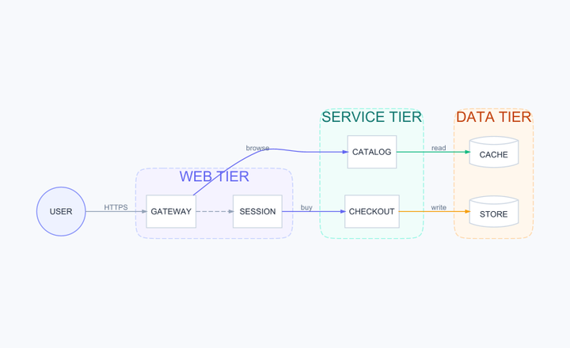</a>
    </td>
    <td width="25%" valign="top">
      <strong>Orthogonal routing</strong><br/>
      Obstacle-aware routes made only from horizontal and vertical segments.<br/>
      <a href="docs/gallery/orthogonal-routing.png">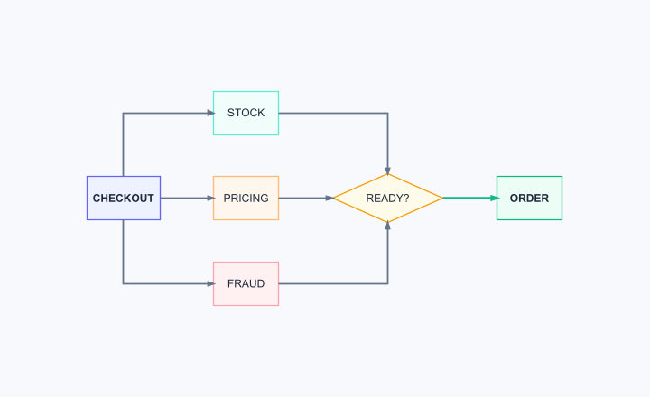</a>
    </td>
    <td width="25%" valign="top">
      <strong>Edge routing and arrows</strong><br/>
      Spline routes, line styles, labels, and arrowhead variants.<br/>
      <a href="docs/gallery/edge-routing.png">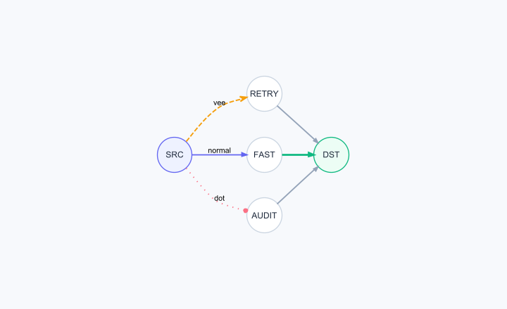</a>
    </td>
    <td width="25%" valign="top">
      <strong>Rank constraints</strong><br/>
      Explicit same-rank groups forming aligned stages in a hierarchical layout.<br/>
      <a href="docs/gallery/rank-constraints.png">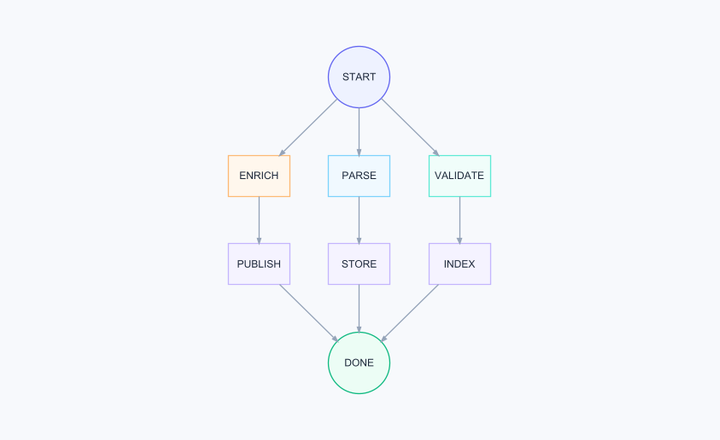</a>
    </td>
  </tr>
  <tr>
    <td width="25%" valign="top">
      <strong>Parallel and self edges</strong><br/>
      Multiple labeled routes between two nodes, a reverse edge, and a self-loop.<br/>
      <a href="docs/gallery/parallel-self-edges.png">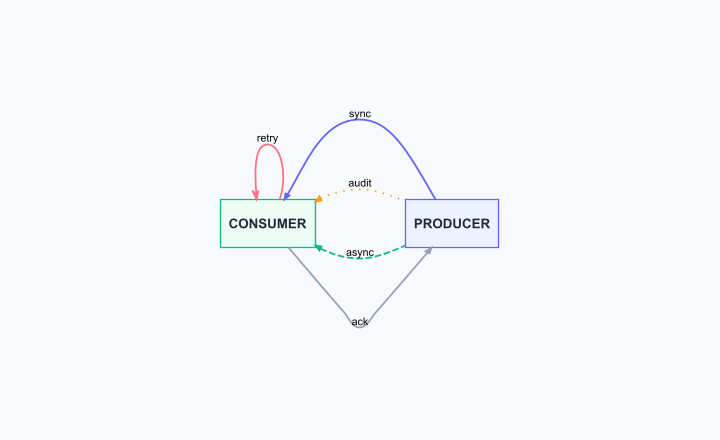</a>
    </td>
    <td width="25%" valign="top">
      <strong>Routing and conditional flow</strong><br/>
      Decisions, success and rollback paths, and a non-constraining feedback edge.<br/>
      <a href="docs/gallery/release-flightpath.png">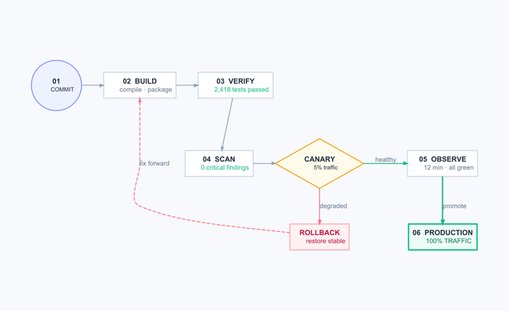</a>
    </td>
    <td width="25%" valign="top">
      <strong>Force-directed relationships</strong><br/>
      A JFDP semantic network with mixed node sizes and relationship emphasis.<br/>
      <a href="docs/gallery/knowledge-constellation.png">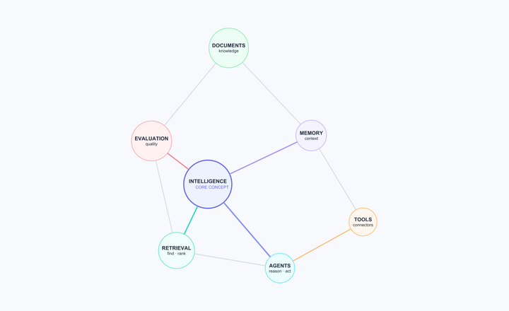</a>
    </td>
    <td width="25%" valign="top">
      <strong>Architecture composition</strong><br/>
      Clusters, cylinders, rich labels, state colors, and routed service dependencies.<br/>
      <a href="docs/gallery/orbit-platform.png">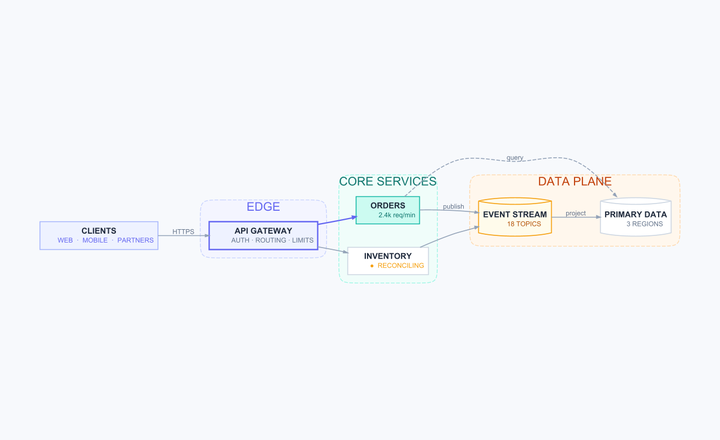</a>
    </td>
  </tr>
</table>

More examples are available under [`docs`](docs) and [`test`](test).

## Build and Test

Build from the repository root. Maven runs static checks and tests as part of the build;
tests run headless by default. See [Static Checks](config/checkstyle/README.md) for contributor rules.

```bash
git clone https://github.com/jamisonjiang/graph-support.git
cd graph-support

# Build every module and run the test suite
mvn clean install

# Build only the runnable CLI and its dependencies
mvn -pl cli -am package

```

## Documentation and Support

- [Documentation](docs)
- [Node shapes](docs/node/Shape.md) and [arrow shapes](docs/edge/ArrowHead.md)
- [Release notes](https://github.com/jamisonjiang/graph-support/releases)
- [Issue tracker](https://github.com/jamisonjiang/graph-support/issues)

## Contributing

Contributions are welcome, especially for layout algorithms, node and arrow shapes, DOT
compatibility, documentation, and bug fixes. Open an issue before a large change so the design can
be discussed first.

## License

Licensed under the [Apache License 2.0](LICENSE).
