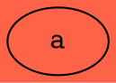

# Color Values

## **Color in DOT**

When specifying colors in DOT, you can use either:

1. **Named Colors** (e.g., `red`, `blue`, `lightblue`).
2. **Hexadecimal** format (e.g., `#RRGGBB`).

## Named Colors in DOT

| **Name**     | **Hex Code** | **Description**                                              |
| ------------ | ------------ | ------------------------------------------------------------ |
| `black`      | `#000000`    | Pure black.                                                  |
| `white`      | `#FFFFFF`    | Pure white.                                                  |
| `red`        | `#FF0000`    | Pure red.                                                    |
| `orange`     | `#FFA500`    | Vivid orange.                                                |
| `yellow`     | `#FFFF00`    | Bright yellow.                                               |
| `green`      | `#00FF00`    | Bright green.                                                |
| `blue`       | `#0000FF`    | Pure blue.                                                   |
| `indigo`     | `#4B0082`    | Deep indigo.                                                 |
| `purple`     | `#800080`    | A classic purple.                                            |
| `gold`       | `#FFD700`    | Rich golden color.                                           |
| `grey`       | `#C0C0C0`    | Neutral silver-grey.                                         |
| `pink`       | `#FFC0CB`    | Light pink tone.                                             |
| `bisque`     | `#FFE4C4`    | Pale orange-pink color reminiscent of creamy bisque.         |
| `lightgrey`  | `#D3D3D3`    | Lighter shade of grey.                                       |
| `lightblue`  | `#FFFF00`    | **(Incorrect: Same as Yellow)** Light blue in your mapping matches yellow. Should be adjusted if needed. |
| `chartreuse` | `#7FFF00`    | Vibrant, yellowish-green color (named after the French liqueur). |

## Hexadecimal Colors 

A [HTML HEX Colors](https://www.w3schools.com/html/html_colors_hex.asp) where the RR (red), GG (green) and BB (blue) hexadecimal integers specify the components of the color.

Using in dot



Using in java

```java
Color color = Color.ofRGB("#ff6347");
```

