# HTML Table

## Overview

`graph-support` allows **HTML Table** for nodes, edges, and clusters (subgraphs). These labels can contain tables (`<TABLE>`), rows (`<TR>`), cells (`<TD>`). While these are *HTML-like*, not all HTML features are supported—only a subset that `graph-support` internal label renderer understands.

Using HTML tables makes it possible to create more structured, multi-line node labels, rather than a simple, single-line label string.

------

## Basic Structure

A valid HTML-like table uses the following nested tag structure:

```dot
<TABLE [table attributes]>
  <TR>
    <TD [td attributes]>Cell Content</TD>
    <TD [td attributes]>Cell Content</TD>
    ...
  </TR>
  <TR>
    <TD [td attributes]>Cell Content</TD>
    ...
  </TR>
</TABLE>
```

You must wrap your entire label in `<`**`<`** and `>`**`>`** For example:

```dot
node1 [label=<
  <TABLE BORDER="1" CELLBORDER="1" CELLSPACING="0">
    <TR><TD>Header 1</TD><TD>Header 2</TD></TR>
    <TR><TD>Row 1, Col 1</TD><TD>Row 1, Col 2</TD></TR>
  </TABLE>
>];
```

------

## Table Tag & Attributes

**General Usage**:

```html
<TABLE 
    ID="myTable" 
    ALIGN="LEFT|CENTER|RIGHT"
    VALIGN="TOP|CENTER|BOTTOM"
    BGCOLOR="#D3D3D3"
    BORDER="1"
    CELLBORDER="1"
    CELLSPACING="0"
    CELLPADDING="4"
    FIXEDSIZE="FALSE"
    WIDTH="200"
    HEIGHT="80"
    COLOR="black"
    HREF="https://example.org"
    TOOLTIP="This is a tooltip"
    STYLE="ROUNDED"
>
```

**Attributes detail**

1. **ID**
   - Assigns a unique identifier to the table.
   - Useful for programmatic interaction or referencing the table in the output.
2. **ALIGN**
   - Horizontal alignment of table content.
   - Values: `LEFT`, `CENTER`, `RIGHT`.
3. **VALIGN**
   - Vertical alignment of table content within its enclosing context.
   - Values: `TOP`, `CENTER`, `BOTTOM`.
4. **BGCOLOR**
   - Sets the background color of the entire table.
   - Accepts named colors or hexadecimal values.
5. **BORDER**
   - Defines the outer border thickness of the table.
   - Integer values (`0` for no border, higher values for thicker borders).
6. **CELLBORDER**
   - Specifies the border thickness for individual cells.
   - Integer values (`0` for no cell borders, higher values for thicker cell borders).
7. **CELLSPACING**
   - Defines the spacing between cells in the table.
   - Integer values (`0` for no spacing, higher values for larger gaps).
8. **CELLPADDING**
   - Sets the padding inside each cell.
   - Integer values (`0` for no padding, higher values for more space around cell content).
9. **FIXEDSIZE**
   - Determines if the table has fixed dimensions or resizes dynamically.
   - Values: `TRUE` (fixed) or `FALSE` (dynamic).
10. **WIDTH**
    - Sets the suggested width of the table.
    - Used only when `FIXEDSIZE="TRUE"`.
11. **HEIGHT**
    - Sets the suggested height of the table.
    - Used only when `FIXEDSIZE="TRUE"`.
12. **COLOR**
    - Defines the border color of the table.
13. **HREF**
    - Creates a hyperlink for the table.
    - Clicking on the table navigates to the specified URL in applicable outputs ( only work for SVG).
14. **TOOLTIP**
    - Sets hover text for the table.
    - Displays a tooltip when hovering over the table in supported outputs.
15. **STYLE**
    - Adds visual styles to the table cell (e.g., rounded corners).

------

## Row Tag & Attributes

**General Usage**:

```html
<TR 
    <!-- No attributes -->
>
```

No attributes for `<TR>` tag

------

## Cell Tag & Attributes

**General Usage**:

```html
<TD
  ID="value"
  ALIGN="LEFT|CENTER|RIGHT"
  VALIGN="TOP|CENTER|BOTTOM"
  BGCOLOR="color"
  CELLPADDING="value"
  COLOR="color"
  FIXEDSIZE="FALSE|TRUE"
  WIDTH="value"
  HEIGHT="value"
  HREF="value"
  TOOLTIP="value"
  STYLE="value"
  BORDER="value"
  COLSPAN="value"
  ROWSPAN="value"
  FONTNAME="value"
  FONTCOLOR="color"
  FONTSIZE="value"
  SHAPE="value"
/>
```

**Attributes Detail**

1. **ID**
   - Assigns a unique identifier to the cell.
   - Useful for referencing the cell programmatically or in outputs.
2. **ALIGN**
   - Specifies the horizontal alignment of the cell content.
   - **Values**: `LEFT`, `CENTER`, `RIGHT`.
3. **VALIGN**
   - Specifies the vertical alignment of the cell content.
   - **Values**: `TOP`, `CENTER`, `BOTTOM`.
4. **BGCOLOR**
   - Sets the background color of the cell.
   - **Values**: Accepts color names (e.g., `RED`) or hexadecimal values (e.g., `#FFFFFF`).
5. **CELLPADDING**
   - Defines the padding inside the cell.
   - **Values**: Positive integer values (`0` for no padding).
6. **COLOR**
   - Sets the border color of the cell.
   - **Values**: Accepts color names or hexadecimal values.
7. **FIXEDSIZE**
   - Specifies whether the cell should have a fixed size.
   - **Values**: `TRUE` (fixed size), `FALSE` (dynamic resizing).
8. **WIDTH**
   - Sets the width of the cell.
   - **Values**: Positive numeric values.
9. **HEIGHT**
   - Sets the height of the cell.
   - **Values**: Positive numeric values.
10. **HREF**
    - Assigns a hyperlink to the cell.
    - **Values**: A valid URL.
11. **TOOLTIP**
    - Defines a tooltip text for the cell.
    - **Values**: Any string.
12. **STYLE**
    - Applies additional styles to the cell.
    - **Values**: Styles defined in `NodeStyle` (e.g., `ROUNDED`, `FILLED`).
13. **BORDER**
    - Specifies the border thickness of the cell.
    - **Values**: Positive integer values (`0` for no border).
14. **COLSPAN**
    - Defines the number of columns the cell spans.
    - **Values**: Positive integer values (`1` for no merging).
15. **ROWSPAN**
    - Defines the number of rows the cell spans.
    - **Values**: Positive integer values (`1` for no merging).
16. **FONTNAME**
    - Specifies the font family for the text in the cell.
    - **Values**: Any valid font name (e.g., `Arial`, `Times New Roman`).
17. **FONTCOLOR**
    - Sets the font color of the text in the cell.
    - **Values**: Accepts color names or hexadecimal values.
18. **FONTSIZE**
    - Specifies the font size for the text in the cell.
    - **Values**: Positive numeric values.
19. **SHAPE**
    - Specifies the shape of the cell.
    - **Values**: Supported shapes in `NodeShapeEnum` (e.g., `RECTANGLE`, `CIRCLE`).

## TD text

TD text support following structure:

* **Simple text**
  * A basic string text displayed within the node. This is the simplest way to set a node's label.
* **[Label Tag](./LabelTag)**
  *  Provide a **rich text formatting experience**.

**Example**:

Dot

```html
<TD>
  <B>Bold text</B><BR/>
  Normal text<BR/>
  <FONT COLOR="red">Red text</FONT>
</TD>
```

## Examples

### Table|TR|TD

Dot example

```dot
digraph {
    node [shape=plaintext];

    table_node [label=<
        <TABLE BORDER="2" CELLPADDING="5" CELLSPACING="0" BGCOLOR="#E0E0E0" STYLE="ROUNDED">
            <TR>
                <TD ID="cell1" ALIGN="CENTER" VALIGN="TOP" BGCOLOR="#FFD700" CELLPADDING="5"
                    COLOR="black" FIXEDSIZE="TRUE" WIDTH="100" HEIGHT="50" HREF="https://example.org"
                    TOOLTIP="This is a tooltip" STYLE="ROUNDED" BORDER="1"
                    COLSPAN="2" ROWSPAN="1" FONTNAME="Arial" FONTCOLOR="blue"
                    FONTSIZE="14" SHAPE="RECTANGLE">
                    Header Cell 1
                </TD>
            </TR>
        </TABLE>
    >];
}
```



Java example

```java
import static org.graphper.api.Html.table;
import static org.graphper.api.Html.td;

Node tableNode = Node.builder()
        .table(
            table()
                .border(2) // Set the outer table border
                .cellPadding(5) // Padding inside the cells
                .cellSpacing(0) // No spacing between cells
                .bgColor(Color.ofRGB("#E0E0E0")) // Light gray background for the table
                .style(NodeStyle.ROUNDED) // Rounded corners for the table
                .tr( // First row
                     td()
                         .id("cell1")
                         .align(Labeljust.CENTER)
                         .valign(Labelloc.TOP)
                         .bgColor(Color.ofRGB("#FFD700")) // Gold background
                         .cellPadding(5)
                         .color(Color.BLACK)
                         .fixedSize(true)
                         .width(100)
                         .height(50)
                         .href("https://example.org")
                         .tooltip("This is a tooltip")
                         .style(NodeStyle.ROUNDED)
                         .border(1)
                         .colSpan(2)
                         .fontName("Arial")
                         .fontColor(Color.BLUE)
                         .fontSize(14)
                         .shape(NodeShapeEnum.RECT)
                         .text("Header Cell 1"),
                     td()
                         .id("cell2")
                         .align(Labeljust.LEFT)
                         .valign(Labelloc.CENTER)
                         .bgColor(Color.ofRGB("#87CEEB")) // Light blue background
                         .cellPadding(3)
                         .color(Color.BLACK)
                         .fixedSize(false)
                         .width(80)
                         .height(40)
                         .href("https://example.org")
                         .tooltip("Clickable cell")
                         .border(1)
                         .fontName("Times New Roman")
                         .fontColor(Color.RED)
                         .fontSize(12)
                         .shape(NodeShapeEnum.ELLIPSE)
                         .text("Header Cell 2")
                )
                .tr( // Second row
                     td()
                         .id("cell3")
                         .align(Labeljust.RIGHT)
                         .valign(Labelloc.BOTTOM)
                         .bgColor(Color.ofRGB("#98FB98")) // Pale green background
                         .cellPadding(4)
                         .color(Color.BLACK)
                         .fixedSize(true)
                         .width(90)
                         .height(45)
                         .href("https://example.com")
                         .tooltip("Another tooltip")
                         .style(NodeStyle.ROUNDED)
                         .border(1)
                         .rowSpan(2)
                         .fontName("Courier New")
                         .fontColor(Color.BLACK)
                         .fontSize(10)
                         .shape(NodeShapeEnum.DIAMOND)
                         .text("Row 2, Col 1"),
                     td()
                         .id("cell4")
                         .align(Labeljust.CENTER)
                         .valign(Labelloc.TOP)
                         .bgColor(Color.ofRGB("#FF69B4")) // Hot pink background
                         .cellPadding(4)
                         .color(Color.BLACK)
                         .fixedSize(false)
                         .width(120)
                         .height(50)
                         .href("https://example.com")
                         .tooltip("Hover here")
                         .style(NodeStyle.DASHED)
                         .border(1)
                         .fontName("Verdana")
                         .fontColor(Color.GREEN)
                         .fontSize(11)
                         .shape(NodeShapeEnum.TRIANGLE)
                         .text("Row 2, Col 2")
                )
                .tr( // Third row
                     td()
                         .id("cell5")
                         .align(Labeljust.LEFT)
                         .valign(Labelloc.BOTTOM)
                         .bgColor(Color.ofRGB("#FFA500")) // Orange background
                         .cellPadding(2)
                         .color(Color.BLACK)
                         .fixedSize(true)
                         .width(110)
                         .height(50)
                         .href("https://example.net")
                         .tooltip("Last cell tooltip")
                         .style(NodeStyle.SOLID)
                         .border(1)
                         .colSpan(2)
                         .fontName("Tahoma")
                         .fontColor(Color.PURPLE)
                         .fontSize(13)
                         .shape(NodeShapeEnum.HEXAGON)
                         .text("Row 3, Col 1")
                )
        )
        .build();

    Graphviz graph = Graphviz.digraph()
        .tempNode(Node.builder().shape(NodeShapeEnum.RECORD).build())
        .addNode(tableNode)
        .build();
```

