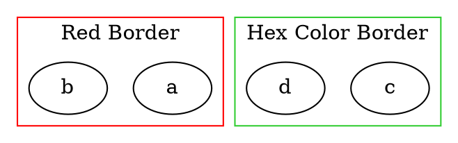

# Color

The **color** attribute sets the **border color of a cluster**. Unlike `fillcolor`, which affects the **background**, `color` controls the **outline color** of the cluster.

------

## **Behavior**

- **Affects only clusters (`subgraph cluster_X {}`)**.
- **Changes the border color of the cluster**.
- **Does not affect the background color** (use `fillcolor` for background).
- **Supports both named colors and hexadecimal color codes**.
- **Gradient colors are \**not\** supported; only solid colors are allowed.**

------

## **Usage in DOT**



### **Explanation**

- **`color="red"`** → Sets a **red border** for the cluster.
- **`color="#32CD32"`** → Uses a **hex color (#32CD32 = Lime Green)**.

------

## **Usage in Java**

```java
Cluster redBorderCluster = Cluster.builder()
    .id("cluster_0")
    .label("Red Border")
    .color(Color.RED)  // Sets border to red
    .addNode(Node.builder().id("a").build())
    .addNode(Node.builder().id("b").build())
    .build();

Cluster hexBorderCluster = Cluster.builder()
    .id("cluster_1")
    .label("Hex Color Border")
    .color(Color.ofRGB("#32CD32"))  // Lime green border
    .addNode(Node.builder().id("c").build())
    .addNode(Node.builder().id("d").build())
    .build();

Graphviz graph = Graphviz.digraph()
    .cluster(redBorderCluster)
    .cluster(hexBorderCluster)
    .build();
```

Color detail see [Color Intro](../Color Intro)