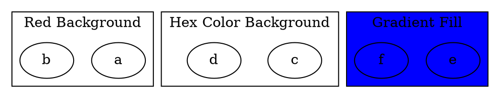

# FillColor

The **fillcolor**  [alias `bgcolor`] attribute sets the **background color of a cluster**. This allows clusters to be visually distinct, improving readability in complex graphs.

------

## **Usage in DOT**



------

## **Usage in Java**

```java
Cluster redCluster = Cluster.builder()
    .id("cluster_0")
    .label("Red Background")
    .bgColor(Color.RED)
    .addNode(Node.builder().id("a").build())
    .addNode(Node.builder().id("b").build())
    .build();

Cluster hexColorCluster = Cluster.builder()
    .id("cluster_1")
    .label("Hex Color Background")
    .bgColor(Color.ofRGB("#ADD8E6")) 
    .addNode(Node.builder().id("c").build())
    .addNode(Node.builder().id("d").build())
    .build();

Cluster gradientCluster = Cluster.builder()
    .id("cluster_2")
    .label("Gradient Fill")
    .bgColor(Color.BLUE)  
    .addNode(Node.builder().id("e").build())
    .addNode(Node.builder().id("f").build())
    .build();

Graphviz graph = Graphviz.digraph()
    .cluster(redCluster)
    .cluster(hexColorCluster)
    .cluster(gradientCluster)
    .build();
```

Color detail see [Color Intro](../Color Intro)