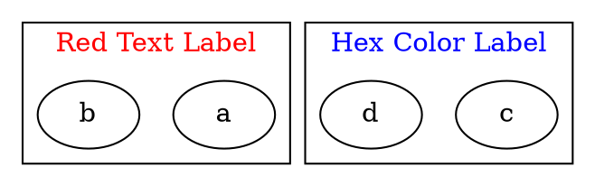

# FontColor

The **fontcolor** attribute sets the **text color of the cluster label**. It affects only the **label text**, not the cluster border or background.

------

## **Behavior**

- **Affects only clusters (`subgraph cluster_X {}`)**.
- **Changes the color of the cluster label text**.
- **Does not affect the border color** (use `color` for that).
- **Does not affect the background color** (use `fillcolor` for that).
- **Supports both named colors and hexadecimal color codes**.

------

## **Usage in DOT**



### **Explanation**

- **`fontcolor="red"`** → Sets the **cluster label text** to **red**.
- **`fontcolor="#0000FF"`** → Uses a **hex color (#0000FF = Blue)** for the **label text**.

------

## **Usage in Java**

```java
Cluster redTextCluster = Cluster.builder()
    .id("cluster_0")
    .label("Red Text Label")
    .fontColor(Color.RED)  // Red label text
    .addNode(Node.builder().id("a").build())
    .addNode(Node.builder().id("b").build())
    .build();

Cluster hexTextCluster = Cluster.builder()
    .id("cluster_1")
    .label("Hex Color Label")
    .fontColor(Color.ofRGB("#0000FF"))  // Blue label text
    .addNode(Node.builder().id("c").build())
    .addNode(Node.builder().id("d").build())
    .build();

Graphviz graph = Graphviz.digraph()
    .cluster(redTextCluster)
    .cluster(hexTextCluster)
    .build();
```

Color detail see [Color Intro](../Color Intro)