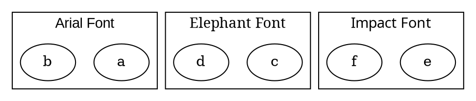

# FontName

The **fontname** attribute specifies the **font family** used for the **cluster label text**. It allows customization of the **text style** within a cluster.

------

## **Behavior**

- **Affects only clusters (`subgraph cluster_X {}`)**.
- **Changes the font of the **cluster label text**.
- **Does not affect the font of nodes inside the cluster**.
- **Supports both system fonts (e.g., `"Arial"`, `"Courier"`) and custom fonts** (if installed on the system).

------

## **Usage in DOT**



### **Explanation**

- **`fontname="Arial"`** → Sets the **cluster label text** to use the **Arial font**.
- **`fontname="Courier"`** → Uses **Courier** for the **cluster label**.
- **`fontname="Impact"`** → Uses **Impact** for the **cluster label**.

------

## **Usage in Java**

```java
Cluster arialCluster = Cluster.builder()
    .id("cluster_0")
    .label("Arial Font")
    .fontName("Arial")  
    .addNode(Node.builder().id("a").build())
    .addNode(Node.builder().id("b").build())
    .build();

Cluster courierCluster = Cluster.builder()
    .id("cluster_1")
    .label("Elephant Font")
    .fontName("Elephant") 
    .addNode(Node.builder().id("c").build())
    .addNode(Node.builder().id("d").build())
    .build();

Cluster impactCluster = Cluster.builder()
    .id("cluster_2")
    .label("Impact Font")
    .fontName("Impact") 
    .addNode(Node.builder().id("e").build())
    .addNode(Node.builder().id("f").build())
    .build();

Graphviz graph = Graphviz.digraph()
    .cluster(arialCluster)
    .cluster(courierCluster)
    .cluster(impactCluster)
    .build();
```