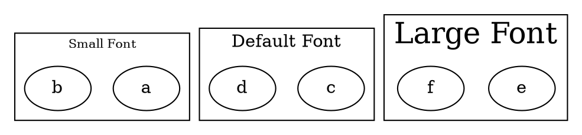

# FontSize

The **fontsize** attribute sets the **font size of the cluster label**. It determines the **text size** for the label displayed at the top of the cluster.

------

## **Behavior**

- **Affects only clusters (`subgraph cluster_X {}`)**.
- **Controls the size of the cluster label text**.
- **Measured in points (pt)**, where **larger values = bigger text**.
- **Does not affect the font size of nodes inside the cluster**.

------

## **Usage in DOT**



### **Explanation**

- **`fontsize=10`** → Sets the **cluster label** to **small text**.
- **Default (no `fontsize` set)** → Uses **Graphviz’s default size (typically `16pt`)**.
- **`fontsize=24`** → Sets the **cluster label** to **large text**.

------

## **Usage in Java**

```java
Cluster smallFontCluster = Cluster.builder()
    .id("cluster_0")
    .label("Small Font")
    .fontSize(10)  // Small text size
    .addNode(Node.builder().id("a").build())
    .addNode(Node.builder().id("b").build())
    .build();

Cluster defaultFontCluster = Cluster.builder()
    .id("cluster_1")
    .label("Default Font")  // Uses default size (typically 16)
    .addNode(Node.builder().id("c").build())
    .addNode(Node.builder().id("d").build())
    .build();

Cluster largeFontCluster = Cluster.builder()
    .id("cluster_2")
    .label("Large Font")
    .fontSize(24)  // Large text size
    .addNode(Node.builder().id("e").build())
    .addNode(Node.builder().id("f").build())
    .build();

Graphviz graph = Graphviz.digraph()
    .cluster(smallFontCluster)
    .cluster(defaultFontCluster)
    .cluster(largeFontCluster)
    .build();
```