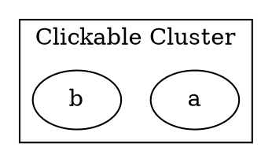

# Href

The **href** [alias `url`] attribute adds a **clickable hyperlink** to a cluster, making it interactive in `SVG` output.

------

## **Behavior**

- **Affects only clusters (`subgraph cluster_X {}`)**.
- **Makes the entire cluster a clickable link** in **SVG** output.
- **Does not work in PNG, JPG, or other raster formats**.
- **Supports absolute URLs (`https://example.com`) **.
- **Alias:** `URL` (Both `href` and `URL` work the same).

------

## **Usage in DOT**



### **Explanation**

- **`href="https://example.com"`** → Clicking the cluster **opens an external webpage**.

------

## **Usage in Java**

```java
Cluster externalLinkCluster = Cluster.builder()
    .id("cluster_0")
    .label("Clickable Cluster")
    .href("https://example.com")  // Links to an external website
    .addNode(Node.builder().id("a").build())
    .addNode(Node.builder().id("b").build())
    .build();

Graphviz graph = Graphviz.digraph()
    .cluster(externalLinkCluster)
    .build();
```