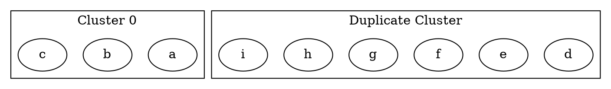

# ID

Sets a unique identifier for a **cluster**. If not specified, it is automatically assigned during rendering.
 **Note**: If multiple clusters share the same ID, only one will be rendered.

------

## **Behavior**

- **Clusters are subgraphs that group nodes together**.
- **Each cluster must have a unique identifier**.
- **If two clusters share the same ID, only one will be rendered**.
- **Cluster IDs should start with `cluster_` to be recognized as a subgraph**.

------

## **Usage in DOT**



### **Explanation**

- **`subgraph cluster_0 { ... }`** → Defines a cluster **with ID `cluster_0`**.
- **`subgraph cluster_1 { ... }`** → Defines a second cluster **with ID `cluster_1`**.
- **A duplicate `cluster_1` is ignored** because the ID is already used.

------

## **Usage in Java**

```java
Cluster cluster0 = Cluster.builder()
    .id("cluster_0")  // Unique cluster ID
    .label("Cluster 0")
    .addNode(Node.builder().id("a").build())
    .addNode(Node.builder().id("b").build())
    .addNode(Node.builder().id("c").build())
    .build();

Cluster cluster1 = Cluster.builder()
    .id("cluster_1")  // Unique cluster ID
    .label("Cluster 1")
    .addNode(Node.builder().id("d").build())
    .addNode(Node.builder().id("e").build())
    .addNode(Node.builder().id("f").build())
    .build();

// If two clusters have the same ID, only one will be rendered
Cluster duplicateCluster = Cluster.builder()
    .id("cluster_1")  // Duplicate ID (ignored)
    .label("Duplicate Cluster")
    .addNode(Node.builder().id("g").build())
    .addNode(Node.builder().id("h").build())
    .addNode(Node.builder().id("i").build())
    .build();

Graphviz graph = Graphviz.digraph()
    .cluster(cluster0)
    .cluster(cluster1)
    .cluster(duplicateCluster)  // This will be ignored due to duplicate ID
    .build();
```