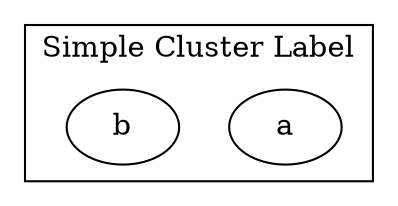
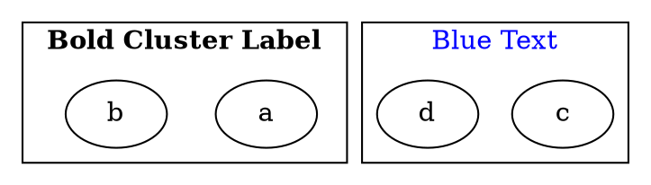
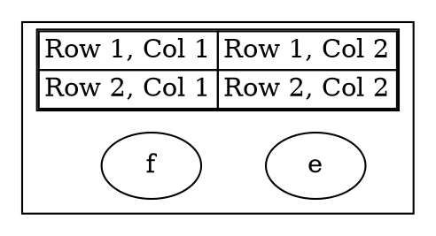

# Label

Defines the **text content** of a **cluster**. Cluster labels can be **simple strings**, **formatted using LabelTag**, or **structured using tables**.

------

## **Using a Simple Cluster Label**

### **Dot**



### **Java**

```java
Cluster cluster = Cluster.builder()
    .id("cluster_0")
    .label("Simple Cluster Label") // Assigns a text label to the cluster
    .addNode(Node.builder().id("a").build())
    .addNode(Node.builder().id("b").build())
    .build();

Graphviz graph = Graphviz.digraph()
    .cluster(cluster)
    .build();
```

✅ **`.label("Simple Cluster Label")`** → Adds a text label to the cluster.

------

## **Using LabelTag for Rich Text Formatting**

Please see here to check [Label Tag](../LabelTag.md) details.

### **Dot**



### **Java**

```java
Cluster boldCluster = Cluster.builder()
    .id("cluster_1")
    .labelTag(bold("Bold Cluster Label")) // Bold cluster label
    .addNode(Node.builder().id("a").build())
    .addNode(Node.builder().id("b").build())
    .build();

Cluster blueCluster = Cluster.builder()
    .id("cluster_2")
    .labelTag(font("Blue Text", fontAttrs().color(Color.BLUE))) // Blue text
    .addNode(Node.builder().id("c").build())
    .addNode(Node.builder().id("d").build())
    .build();

Graphviz graph = Graphviz.digraph()
    .cluster(boldCluster)
    .cluster(blueCluster)
    .build();
```

✅ **`.labelTag(...)`** → Allows rich text formatting for cluster labels.

------

## **Using Tables in Cluster Labels**

Cluster labels support **[tables](../Table.md)**, allowing structured content inside a cluster label.

### **Dot**



### **Java**

```java
Cluster tableCluster = Cluster.builder()
    .id("cluster_3")
    .table(
        table()
            .border(1)
            .cellBorder(1)
            .cellSpacing(0)
            .tr(td().text("Row 1, Col 1"), td().text("Row 1, Col 2"))
            .tr(td().text("Row 2, Col 1"), td().text("Row 2, Col 2"))
    )
    .addNode(Node.builder().id("e").build())
    .addNode(Node.builder().id("f").build())
    .build();

Graphviz graph = Graphviz.digraph()
    .cluster(tableCluster)
    .build();
```