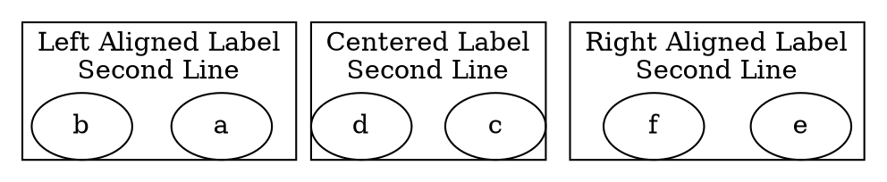

# Labeljust

The **labeljust** attribute controls **the horizontal alignment of a cluster label** relative to the cluster's bounding box. It only affects **multi-line labels** and does not apply to single-line labels.

------

## **Behavior**

- **Affects only clusters (`subgraph cluster_X {}`)**.
- **Controls whether the label is left-aligned, center-aligned, or right-aligned within the cluster box**.
- **Only affects multi-line labels**.
- Valid values
  - `"l"` → Left-aligns the label within the cluster.
  - `"c"` → Centers the label (default).
  - `"r"` → Right-aligns the label within the cluster.

------

## **Usage in DOT**



### **Explanation**

- **`labeljust="l"`** → Left-aligns the **multi-line cluster label**.
- **`labeljust="c"`** → Centers the label **(default behavior)**.
- **`labeljust="r"`** → Right-aligns the **multi-line cluster label**.

------

## **Usage in Java**

```java
Cluster leftLabelCluster = Cluster.builder()
    .id("cluster_0")
    .label("Left Aligned Label\nSecond Line")
    .labelJust(LabelJust.LEFT)  // Left-aligns the label
    .margin(0.6)  // Adds space around the label for better visibility
    .addNode(Node.builder().id("a").build())
    .addNode(Node.builder().id("b").build())
    .build();

Cluster centerLabelCluster = Cluster.builder()
    .id("cluster_1")
    .label("Centered Label\nSecond Line")
    .labelJust(LabelJust.CENTER)  // Centers the label (default)
    .margin(0.6)  // Ensures uniform spacing for better comparison
    .addNode(Node.builder().id("c").build())
    .addNode(Node.builder().id("d").build())
    .build();

Cluster rightLabelCluster = Cluster.builder()
    .id("cluster_2")
    .label("Right Aligned Label\nSecond Line")
    .labelJust(LabelJust.RIGHT)  // Right-aligns the label
    .margin(0.6)  // Adds space to emphasize right alignment
    .addNode(Node.builder().id("e").build())
    .addNode(Node.builder().id("f").build())
    .build();

Graphviz graph = Graphviz.digraph()
    .cluster(leftLabelCluster)
    .cluster(centerLabelCluster)
    .cluster(rightLabelCluster)
    .build();
```