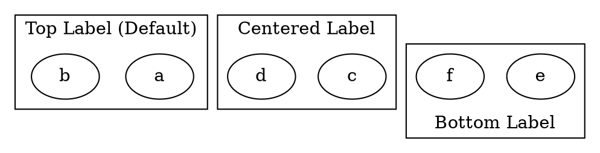

# Labelloc

The **labelloc** attribute controls **the vertical alignment of the cluster label** within the cluster. By default, cluster labels appear at the **top** of the cluster, but this can be changed.

------

## **Behavior**

- **Affects only clusters (`subgraph cluster_X {}`)**.
- **Controls whether the label is positioned at the top, center, or bottom of the cluster box**.
- Valid values
  - `"t"` → Places the label at the **top** (default).
  - `"c"` → Centers the label within the cluster.
  - `"b"` → Places the label at the **bottom** of the cluster.

------

## **Usage in DOT**



### **Explanation**

- **`labelloc="t"`** → Default. The label appears **at the top** of the cluster.
- **`labelloc="c"`** → The label is **centered** within the cluster.
- **`labelloc="b"`** → The label is positioned **at the bottom** of the cluster.

------

## **Usage in Java**

```java
Cluster topLabelCluster = Cluster.builder()
    .id("cluster_0")
    .label("Top Label (Default)")
    .labelloc(Labelloc.TOP)  // Default: Label at the top
    .addNode(Node.builder().id("a").build())
    .addNode(Node.builder().id("b").build())
    .build();

Cluster centerLabelCluster = Cluster.builder()
    .id("cluster_1")
    .label("Centered Label")
    .labelloc(Labelloc.CENTER)  // Label is centered
    .addNode(Node.builder().id("c").build())
    .addNode(Node.builder().id("d").build())
    .build();

Cluster bottomLabelCluster = Cluster.builder()
    .id("cluster_2")
    .label("Bottom Label")
    .labelloc(Labelloc.BOTTOM)  // Label appears at the bottom
    .addNode(Node.builder().id("e").build())
    .addNode(Node.builder().id("f").build())
    .build();

Graphviz graph = Graphviz.digraph()
    .cluster(topLabelCluster)
    .cluster(centerLabelCluster)
    .cluster(bottomLabelCluster)
    .build();
```