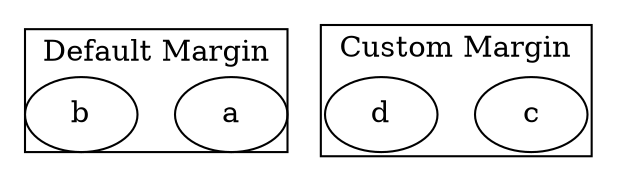

# Margin

The **margin** attribute sets the **internal spacing between the cluster boundary and its contents** (nodes and edges). It ensures that nodes inside the cluster do not **touch or overflow the cluster's border**.

------

## **Behavior**

- **Affects only clusters (`subgraph cluster_X {}`)**.
- **Controls the padding between the cluster boundary and its contents**.
- Supports both single and two-dimensional values (`margin="x,y"`):
  - **Single value (`margin=0.5`)** → Applies uniform padding in both width and height.
  - **Two values (`margin="1,0.5"`)** → Sets **width = 1**, **height = 0.5**.
- **Does not affect individual node margins** inside the cluster.

------

## **Usage in DOT**



### **Explanation**

- **`margin=0.5`** → Adds **equal padding** around all sides of the cluster.
- **`margin="1,0.5"`** → Sets **horizontal padding = 1**, **vertical padding = 0.5**.

------

## **Usage in Java**

```java
Cluster defaultMarginCluster = Cluster.builder()
    .id("cluster_0")
    .label("Default Margin")
    .margin(0.5)
    .addNode(Node.builder().id("a").build())
    .addNode(Node.builder().id("b").build())
    .build();

Cluster customMarginCluster = Cluster.builder()
    .id("cluster_1")
    .label("Custom Margin")
    .margin(2, 1)
    .addNode(Node.builder().id("c").build())
    .addNode(Node.builder().id("d").build())
    .build();

Graphviz graph = Graphviz.digraph()
    .cluster(defaultMarginCluster)
    .cluster(customMarginCluster)
    .build();
```