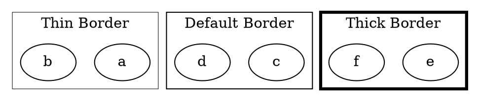

# PenWidth

The **penwidth** attribute controls the **thickness of the cluster's border**. It determines how bold or thin the outline of the cluster appears.

------

## **Behavior**

- **Affects only clusters (`subgraph cluster_X {}`)**.
- **Increases or decreases the border thickness**.
- **Default value is `1.0`**.
- **Higher values make the border thicker**.

------

## **Usage in DOT**



### **Explanation**

- **`penwidth=0.5`** → Creates a **thin border** around the cluster.
- **No `penwidth` specified** → Uses the **default thickness (`1.0`)**.
- **`penwidth=3.0`** → Creates a **bold, thick border**.

------

## **Usage in Java**

```java
Cluster thinBorderCluster = Cluster.builder()
    .id("cluster_0")
    .label("Thin Border")
    .penWidth(0.5)  // Thin border
    .addNode(Node.builder().id("a").build())
    .addNode(Node.builder().id("b").build())
    .build();

Cluster defaultBorderCluster = Cluster.builder()
    .id("cluster_1")
    .label("Default Border")  // Uses default thickness (1.0)
    .addNode(Node.builder().id("c").build())
    .addNode(Node.builder().id("d").build())
    .build();

Cluster thickBorderCluster = Cluster.builder()
    .id("cluster_2")
    .label("Thick Border")
    .penWidth(3.0)  // Thick border
    .addNode(Node.builder().id("e").build())
    .addNode(Node.builder().id("f").build())
    .build();

Graphviz graph = Graphviz.digraph()
    .cluster(thinBorderCluster)
    .cluster(defaultBorderCluster)
    .cluster(thickBorderCluster)
    .build();
```