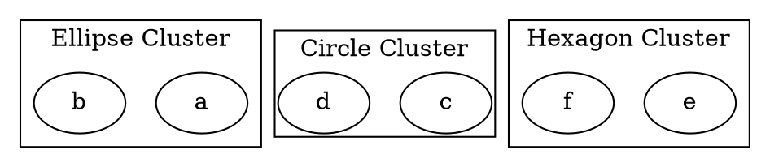

# Shape

The **cluster shape** attribute defines the **visual shape of a cluster's bounding box**. By default, clusters are rectangular (`rect`), but other shapes like **ellipse, circle, trapezium, and polygons** are supported.

Unlike **node shapes**, custom cluster shapes **may not always fully surround all nodes** under the `DOT` layout engine but will try to estimate the container size as accurately as possible.

------

## **Supported Cluster Shapes**

| **Shape Name**     | **Example**             | **Description**                                           |
| ------------------ | ----------------------- | --------------------------------------------------------- |
| **ellipse**        | `shape="ellipse"`       | Draws the cluster as an ellipse.                          |
| **circle**         | `shape="circle"`        | Creates a circular cluster.                               |
| **rect** (default) | `shape="rect"`          | Standard rectangular cluster that fully encloses nodes.   |
| **trapezium**      | `shape="trapezium"`     | Trapezoidal cluster with a wider top and narrower bottom. |
| **invtrapezium**   | `shape="invtrapezium"`  | Inverted trapezium, wider at the bottom.                  |
| **parallelogram**  | `shape="parallelogram"` | Slanted rectangular shape.                                |
| **pentagon**       | `shape="pentagon"`      | Five-sided cluster shape.                                 |
| **hexagon**        | `shape="hexagon"`       | Six-sided polygonal shape.                                |
| **septagon**       | `shape="septagon"`      | Seven-sided polygonal shape.                              |
| **octagon**        | `shape="octagon"`       | Eight-sided polygonal shape.                              |

------

## **Usage in DOT**



### **Explanation**

- **`shape="ellipse"`** → Draws an **elliptical** cluster.
- **`shape="circle"`** → Creates a **circular** cluster.
- **`shape="hexagon"`** → Defines a **six-sided polygonal** cluster.

------

## **Usage in Java**

```java
Cluster ellipseCluster = Cluster.builder()
    .id("cluster_0")
    .label("Ellipse Cluster")
    .shape(ClusterShapeEnum.ELLIPSE)  // Ellipse cluster
    .addNode(Node.builder().id("a").build())
    .addNode(Node.builder().id("b").build())
    .build();

Cluster circleCluster = Cluster.builder()
    .id("cluster_1")
    .label("Circle Cluster")
    .shape(ClusterShapeEnum.CIRCLE)  // Circular cluster
    .margin(2.3)
    .addNode(Node.builder().id("c").build())
    .addNode(Node.builder().id("d").build())
    .build();

Cluster hexagonCluster = Cluster.builder()
    .id("cluster_2")
    .label("Hexagon Cluster")
    .shape(ClusterShapeEnum.HEXAGON)  // Hexagonal cluster
    .addNode(Node.builder().id("e").build())
    .addNode(Node.builder().id("f").build())
    .build();

Graphviz graph = Graphviz.digraph()
    .cluster(ellipseCluster)
    .cluster(circleCluster)
    .cluster(hexagonCluster)
    .build();
```

------

## **Key Considerations for Custom Cluster Shapes**

- **Only `rect` guarantees full containment of nodes** in the **DOT layout engine**.
- **Non-rectangular cluster shapes estimate container size**, which may not always fully enclose all nodes.
- **To ensure proper containment**, avoid nesting non-rectangular clusters.
- **Manually adjusting `margin` can help prevent node overflow in irregular shapes**.