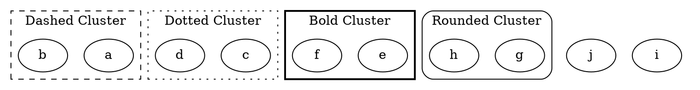

# Style

The **cluster style** attribute controls **the appearance of a cluster's boundary**, including dashed, dotted, bold, and rounded styles. It affects only the **visual representation of the cluster**, not its internal layout.

------

## **Supported Cluster Styles**

| **Style Name** | **Example**       | **Description**                                          |
| -------------- | ----------------- | -------------------------------------------------------- |
| **dashed**     | `style="dashed"`  | Draws the cluster boundary as a **dashed line**.         |
| **dotted**     | `style="dotted"`  | Draws the cluster boundary as a **dotted line**.         |
| **invis**      | `style="invis"`   | Hides the cluster boundary but **still affects layout**. |
| **bold**       | `style="bold"`    | Draws the cluster boundary using a **bold line**.        |
| **rounded**    | `style="rounded"` | Rounds the **corners** of the cluster boundary.          |

------

## **Usage in DOT**



### **Explanation**

- **`style="dashed"`** → Dashed cluster border.
- **`style="dotted"`** → Dotted cluster border.
- **`style="bold"`** → Bold cluster border.
- **`style="rounded"`** → Rounded cluster corners.
- **`style="invis"`** → Hides the cluster while **keeping its layout effect**.

------

## **Usage in Java**

```java
Cluster dashedCluster = Cluster.builder()
    .id("cluster_0")
    .label("Dashed Cluster")
    .style(ClusterStyle.DASHED)  // Dashed boundary
    .addNode(Node.builder().id("a").build())
    .addNode(Node.builder().id("b").build())
    .build();

Cluster dottedCluster = Cluster.builder()
    .id("cluster_1")
    .label("Dotted Cluster")
    .style(ClusterStyle.DOTTED)  // Dotted boundary
    .addNode(Node.builder().id("c").build())
    .addNode(Node.builder().id("d").build())
    .build();

Cluster boldCluster = Cluster.builder()
    .id("cluster_2")
    .label("Bold Cluster")
    .style(ClusterStyle.BOLD)  // Bold boundary
    .addNode(Node.builder().id("e").build())
    .addNode(Node.builder().id("f").build())
    .build();

Cluster roundedCluster = Cluster.builder()
    .id("cluster_3")
    .label("Rounded Cluster")
    .style(ClusterStyle.ROUNDED)  // Rounded corners
    .addNode(Node.builder().id("g").build())
    .addNode(Node.builder().id("h").build())
    .build();

Cluster invisibleCluster = Cluster.builder()
    .id("cluster_4")
    .label("Invisible Cluster")
    .style(ClusterStyle.INVIS)  // Hidden cluster
    .addNode(Node.builder().id("i").build())
    .addNode(Node.builder().id("j").build())
    .build();

Graphviz graph = Graphviz.digraph()
    .cluster(dashedCluster)
    .cluster(dottedCluster)
    .cluster(boldCluster)
    .cluster(roundedCluster)
    .cluster(invisibleCluster)
    .build();
```