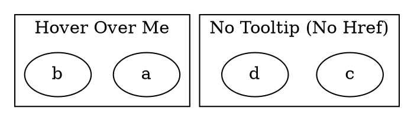

# ToolTip

The **tooltip** attribute sets a **hover text** for a cluster, but it **only takes effect if the cluster has an `href` attribute set**.

------

## **Behavior**

- **Affects only clusters (`subgraph cluster_X {}`)**.
- **Displays a tooltip when hovering over the cluster** in **SVG output**.
- **Does not work in PNG, JPG, or other raster formats**.
- **Requires `href` to be set**, otherwise the tooltip will be ignored.

------

## **Usage in DOT**



### **Explanation**

- **`tooltip="This is a tooltip for Cluster 0"`** → Displays a tooltip **only because `href` is set**.
- **`tooltip="This will not appear"`** → Ignored because **no `href` is set**.

------

## **Usage in Java**

```java
Cluster tooltipCluster = Cluster.builder()
    .id("cluster_0")
    .label("Hover Over Me")
    .href("https://example.com")  // Required for tooltip to work
    .tooltip("This is a tooltip for Cluster 0")
    .addNode(Node.builder().id("a").build())
    .addNode(Node.builder().id("b").build())
    .build();

Cluster ignoredTooltipCluster = Cluster.builder()
    .id("cluster_1")
    .label("No Tooltip (No Href)")
    .tooltip("This will not appear")  // Tooltip is ignored without href
    .addNode(Node.builder().id("c").build())
    .addNode(Node.builder().id("d").build())
    .build();

Graphviz graph = Graphviz.digraph()
    .cluster(tooltipCluster)
    .cluster(ignoredTooltipCluster)
    .build();
```