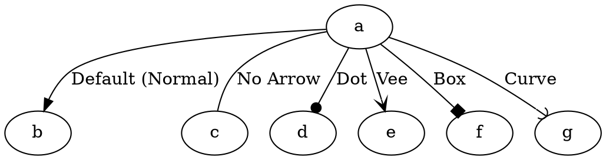

# ArrowHead

The **arrowhead** attribute defines the **shape of the arrow** at the **head (destination) of an edge**. The Java API supports the following **sixteen fixed arrow styles**.

------

## **Supported Arrowhead Styles**

| **Arrowhead** | **Effect**            | **Example DOT Code**         |
| ------------- | --------------------- | ---------------------------- |
| `NORMAL`      | Default arrowhead     | `a -> b [arrowhead=normal];` |
| `NONE`        | No arrow at the head  | `a -> b [arrowhead=none];`   |
| `DOT`         | Small dot arrow       | `a -> b [arrowhead=dot];`    |
| `VEE`         | Wide "V" shaped arrow | `a -> b [arrowhead=vee];`    |
| `BOX`         | Small box arrow       | `a -> b [arrowhead=box];`    |
| `CURVE`       | Curved arrow          | `a -> b [arrowhead=curve];`  |
| `DIAMOND`     | Filled diamond        | `a -> b [arrowhead=diamond];` |
| `INV`         | Inverted triangle     | `a -> b [arrowhead=inv];` |
| `TEE`         | Transverse bar and stem | `a -> b [arrowhead=tee];` |
| `CROW`        | Three-pronged crow's foot | `a -> b [arrowhead=crow];` |
| `ICURVE`      | Reversed curved arrow | `a -> b [arrowhead=icurve];` |
| `ONORMAL`     | Hollow normal triangle | `a -> b [arrowhead=onormal];` |
| `OINV`        | Hollow inverted triangle | `a -> b [arrowhead=oinv];` |
| `OBOX`        | Hollow box            | `a -> b [arrowhead=obox];` |
| `ODOT`        | Hollow circle         | `a -> b [arrowhead=odot];` |
| `ODIAMOND`    | Hollow diamond        | `a -> b [arrowhead=odiamond];` |

These are fixed enum values, not a general Graphviz arrow grammar. Composite arrows
(such as `normaldiamond`) and `l`/`r` half-shape modifiers are not supported.
Use the canonical names above; deprecated aliases are not part of this API.

## **Behavior**

- **Defines the shape of the arrow at the edge head (target node)**.
- **Applies only to directed graphs (`digraph`)**.
- Displayed when `dir` is `forward` (the default) or `both`.
- Hollow variants have the same geometry and clipping size as their filled counterpart,
  but use `fill="none"`, leaving the background visible. `CURVE` and `ICURVE` are also unfilled.
- Arrow outlines use the edge color and pen width, including bold styling. Filled arrows
  use the edge color for their interior. Dashed/dotted edge styles do not dash the arrows.
- `arrowsize=0` produces degenerate, finite geometry; use `NONE` to disable an arrow.
- Existing arrow proportions are preserved, rather than promising pixel-identical Graphviz output.

------

## **Usage in DOT**


```dot
digraph G {
    a -> b [label="Default (Normal)", arrowhead=normal];
    a -> c [label="No Arrow", arrowhead=none];
    a -> d [label="Dot", arrowhead=dot];
    a -> e [label="Vee", arrowhead=vee];
    a -> f [label="Box", arrowhead=box];
    a -> g [label="Curve", arrowhead=curve];
}
```

### **Explanation**

- **`a -> b [arrowhead=normal]`** → Standard **default arrowhead**.
- **`a -> c [arrowhead=none]`** → No arrow at the head.
- **`a -> d [arrowhead=dot]`** → Small dot arrow.
- **`a -> e [arrowhead=vee]`** → Wide "V" shaped arrow.
- **`a -> f [arrowhead=box]`** → Small box arrow.
- **`a -> g [arrowhead=curve]`** → Curved arrow.

------

## **Usage in Java**

Any supported enum can be passed to the existing builder API:

```java
Line hollowDiamond = Line.builder(a, b)
    .arrowHead(ArrowShape.ODIAMOND)
    .build();
```

```java
Node a = Node.builder().id("a").build();
Node b = Node.builder().id("b").build();
Node c = Node.builder().id("c").build();
Node d = Node.builder().id("d").build();
Node e = Node.builder().id("e").build();
Node f = Node.builder().id("f").build();
Node g = Node.builder().id("g").build();

// Default arrowhead (normal)
Line normalArrow = Line.builder(a, b)
    .label("Default (Normal)")
    .arrowHead(ArrowShape.NORMAL) // Default arrow
    .build();

// No arrowhead
Line noArrow = Line.builder(a, c)
    .label("No Arrow")
    .arrowHead(ArrowShape.NONE) // No arrow
    .build();

// Dot arrowhead
Line dotArrow = Line.builder(a, d)
    .label("Dot")
    .arrowHead(ArrowShape.DOT) // Small dot
    .build();

// Vee arrowhead
Line veeArrow = Line.builder(a, e)
    .label("Vee")
    .arrowHead(ArrowShape.VEE) // Wide "V" shape
    .build();

// Box arrowhead
Line boxArrow = Line.builder(a, f)
    .label("Box")
    .arrowHead(ArrowShape.BOX) // Small box arrow
    .build();

// Curve arrowhead
Line curveArrow = Line.builder(a, g)
    .label("Curve")
    .arrowHead(ArrowShape.CURVE) // Curved arrow
    .build();

Graphviz graph = Graphviz.digraph()
    .addLine(normalArrow)
    .addLine(noArrow)
    .addLine(dotArrow)
    .addLine(veeArrow)
    .addLine(boxArrow)
    .addLine(curveArrow)
    .build();
```
