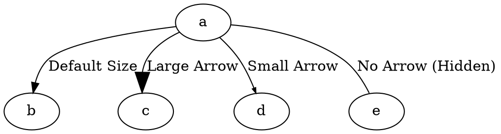

# ArrowSize

The **arrowsize** attribute controls the **scaling factor** of the **arrowhead and arrowtail size** on an edge. This applies to both the **start (arrowtail)** and **end (arrowhead)** of an edge.

------

## **Behavior**

- **Affects both arrowhead (destination) and arrowtail (source)**.
- **Default size is `1.0`** (normal arrow size).
- **Values greater than `1.0` increase the size** of the arrow.
- **Values between `0.0` and `1.0` shrink the arrow**.
- **A value of `0.0` makes the arrow invisible**.

------

## **Usage in DOT**



### **Explanation**

- **`a -> b`** → Uses the **default arrowsize** (`arrowsize=1.0`).
- **`a -> c`** → **Doubles the arrow size** (`arrowsize=2.0`).
- **`a -> d`** → **Shrinks the arrow** (`arrowsize=0.5`).
- **`a -> e`** → **Hides the arrow** (`arrowsize=0.0`).

⚠ **Note:** Even when `arrowsize=0.0`, the edge still exists but will appear without an arrow.

------

## **Usage in Java**

```java
Node a = Node.builder().id("a").build();
Node b = Node.builder().id("b").build();
Node c = Node.builder().id("c").build();
Node d = Node.builder().id("d").build();
Node e = Node.builder().id("e").build();

// Default arrow size (1.0)
Line defaultArrow = Line.builder(a, b)
    .label("Default Size")
    .arrowSize(1.0) // Normal size
    .build();

// Large arrow (2x normal size)
Line largeArrow = Line.builder(a, c)
    .label("Large Arrow")
    .arrowSize(2.0) // Doubles the size
    .build();

// Small arrow (50% normal size)
Line smallArrow = Line.builder(a, d)
    .label("Small Arrow")
    .arrowSize(0.5) // Half the size
    .build();

// Hidden arrow (size = 0)
Line hiddenArrow = Line.builder(a, e)
    .label("No Arrow (Hidden)")
    .arrowSize(0.0) // Invisible arrow
    .build();

Graphviz graph = Graphviz.digraph()
    .addLine(defaultArrow)
    .addLine(largeArrow)
    .addLine(smallArrow)
    .addLine(hiddenArrow)
    .build();
```

