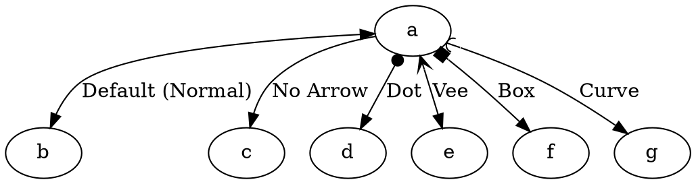

# ArrowTail

The **arrowtail** attribute defines the **shape of the arrow at the tail (source) of an edge**. It works similarly to **arrowhead** but applies to the **beginning of the edge instead of the end**.

------

## **Behavior**

- **Defines the shape of the arrow at the edge tail (source node)**.
- **Applies only to directed graphs (`digraph`)**.
- **If omitted, no arrow is added at the tail**.
- **Dir attribute should be back or both**

------

## **Supported Arrowtail Styles**

| **Arrowtail** | **Effect**            | **Example DOT Code**         |
| ------------- | --------------------- | ---------------------------- |
| `NORMAL`      | Default arrowhead     | `a -> b [arrowtail=normal];` |
| `NONE`        | No arrow at the tail  | `a -> b [arrowtail=none];`   |
| `DOT`         | Small dot arrow       | `a -> b [arrowtail=dot];`    |
| `VEE`         | Wide "V" shaped arrow | `a -> b [arrowtail=vee];`    |
| `BOX`         | Small box arrow       | `a -> b [arrowtail=box];`    |
| `CURVE`       | Curved arrow          | `a -> b [arrowtail=curve];`  |

⚠ **Note:** Only these **six arrowtail styles** are supported so far.

------

## **Usage in DOT**



### **Explanation**

- **`a -> b [arrowtail=normal]`** → Standard **default arrow at the tail**.
- **`a -> c [arrowtail=none]`** → No arrow at the tail.
- **`a -> d [arrowtail=dot]`** → Small dot arrow at the tail.
- **`a -> e [arrowtail=vee]`** → Wide "V" shaped arrow at the tail.
- **`a -> f [arrowtail=box]`** → Small box arrow at the tail.
- **`a -> g [arrowtail=curve]`** → Curved arrow at the tail.

------

## **Usage in Java**

```java
Node a = Node.builder().id("a").build();
Node b = Node.builder().id("b").build();
Node c = Node.builder().id("c").build();
Node d = Node.builder().id("d").build();
Node e = Node.builder().id("e").build();
Node f = Node.builder().id("f").build();
Node g = Node.builder().id("g").build();

// Default arrowtail (normal)
Line normalArrow = Line.builder(a, b)
    .label("Default (Normal)")
    .arrowTail(ArrowShape.NORMAL) // Default arrow at the tail
    .build();

// No arrowtail
Line noArrow = Line.builder(a, c)
    .label("No Arrow")
    .arrowTail(ArrowShape.NONE) // No arrow at the tail
    .build();

// Dot arrowtail
Line dotArrow = Line.builder(a, d)
    .label("Dot")
    .arrowTail(ArrowShape.DOT) // Small dot at the tail
    .build();

// Vee arrowtail
Line veeArrow = Line.builder(a, e)
    .label("Vee")
    .arrowTail(ArrowShape.VEE) // Wide "V" shape at the tail
    .build();

// Box arrowtail
Line boxArrow = Line.builder(a, f)
    .label("Box")
    .arrowTail(ArrowShape.BOX) // Small box at the tail
    .build();

// Curve arrowtail
Line curveArrow = Line.builder(a, g)
    .label("Curve")
    .arrowTail(ArrowShape.CURVE) // Curved arrow at the tail
    .build();

Graphviz graph = Graphviz.digraph()
    .tempLine(Line.tempLine().dir(Dir.BOTH).build())
    .addLine(normalArrow)
    .addLine(noArrow)
    .addLine(dotArrow)
    .addLine(veeArrow)
    .addLine(boxArrow)
    .addLine(curveArrow)
    .build();
```

