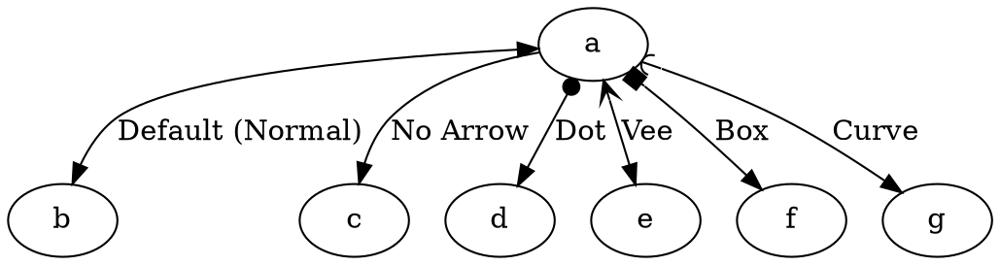

# ArrowTail

The **arrowtail** attribute defines the **shape of the arrow at the tail (source) of an edge**. It works similarly to **arrowhead** but applies to the **beginning of the edge instead of the end**.

------

## **Behavior**

- **Defines the shape of the arrow at the edge tail (source node)**.
- **Applies only to directed graphs (`digraph`)**.
- **The default `dir=forward` does not display a tail arrow**.
- **Set `dir=back` or `dir=both` to display it; the default tail shape is `NORMAL`**.

------

## **Supported Arrowtail Styles**

| **Arrowtail** | **Effect**            | **Example DOT Code**         |
| ------------- | --------------------- | ---------------------------- |
| `NORMAL`      | Default arrowhead     | `a -> b [arrowtail=normal];` |
| `NONE`        | No arrow at the tail  | `a -> b [arrowtail=none];`   |
| `DOT`         | Small dot arrow       | `a -> b [arrowtail=dot];`    |
| `VEE`         | Wide "V" shaped arrow | `a -> b [arrowtail=vee];`    |
| `BOX`         | Small box arrow       | `a -> b [arrowtail=box];`    |
| `CURVE`       | Curved arrow          | `a -> b [arrowtail=curve];`  |
| `DIAMOND`     | Filled diamond        | `a -> b [arrowtail=diamond];` |
| `INV`         | Inverted triangle     | `a -> b [arrowtail=inv];` |
| `TEE`         | Transverse bar and stem | `a -> b [arrowtail=tee];` |
| `CROW`        | Three-pronged crow's foot | `a -> b [arrowtail=crow];` |
| `ICURVE`      | Reversed curved arrow | `a -> b [arrowtail=icurve];` |
| `ONORMAL`     | Hollow normal triangle | `a -> b [arrowtail=onormal];` |
| `OINV`        | Hollow inverted triangle | `a -> b [arrowtail=oinv];` |
| `OBOX`        | Hollow box            | `a -> b [arrowtail=obox];` |
| `ODOT`        | Hollow circle         | `a -> b [arrowtail=odot];` |
| `ODIAMOND`    | Hollow diamond        | `a -> b [arrowtail=odiamond];` |

All sixteen fixed styles work at either end. The DOT examples in this table require
`edge [dir=both]` or `edge [dir=back]` to make the tail visible.

Hollow variants retain the geometry and clipping size of their filled counterpart,
with `fill="none"` so the background remains visible. `CURVE` and `ICURVE` are also
unfilled. Both ends independently use their selected shape's fill behavior and share
the edge color, pen width, and bold styling. Dashed/dotted styles affect the edge,
not the arrows. A zero arrow size produces finite degenerate geometry; `NONE`
explicitly disables an arrow.

Composite arrows and `l`/`r` half-shape modifiers are not supported. Use the canonical
names above; deprecated aliases are not part of the Java API. Existing arrow
proportions are preserved, rather than promising pixel-identical Graphviz output.

------

## **Usage in DOT**


```dot
digraph G {
    edge[dir=both]
    a -> b [label="Default (Normal)", arrowtail=normal];
    a -> c [label="No Arrow", arrowtail=none];
    a -> d [label="Dot", arrowtail=dot];
    a -> e [label="Vee", arrowtail=vee];
    a -> f [label="Box", arrowtail=box];
    a -> g [label="Curve", arrowtail=curve];
}
```

### **Explanation**

- **`a -> b [arrowtail=normal]`** → Standard **default arrow at the tail**.
- **`a -> c [arrowtail=none]`** → No arrow at the tail.
- **`a -> d [arrowtail=dot]`** → Small dot arrow at the tail.
- **`a -> e [arrowtail=vee]`** → Wide "V" shaped arrow at the tail.
- **`a -> f [arrowtail=box]`** → Small box arrow at the tail.
- **`a -> g [arrowtail=curve]`** → Curved arrow at the tail.

------

## **Usage in Java**

For example, combine a filled head with a hollow tail:

```java
Line mixedArrows = Line.builder(a, b)
    .dir(Dir.BOTH)
    .arrowHead(ArrowShape.DIAMOND)
    .arrowTail(ArrowShape.OINV)
    .build();
```

```java
Node a = Node.builder().id("a").build();
Node b = Node.builder().id("b").build();
Node c = Node.builder().id("c").build();
Node d = Node.builder().id("d").build();
Node e = Node.builder().id("e").build();
Node f = Node.builder().id("f").build();
Node g = Node.builder().id("g").build();

// Default arrowtail (normal)
Line normalArrow = Line.builder(a, b)
    .label("Default (Normal)")
    .arrowTail(ArrowShape.NORMAL) // Default arrow at the tail
    .build();

// No arrowtail
Line noArrow = Line.builder(a, c)
    .label("No Arrow")
    .arrowTail(ArrowShape.NONE) // No arrow at the tail
    .build();

// Dot arrowtail
Line dotArrow = Line.builder(a, d)
    .label("Dot")
    .arrowTail(ArrowShape.DOT) // Small dot at the tail
    .build();

// Vee arrowtail
Line veeArrow = Line.builder(a, e)
    .label("Vee")
    .arrowTail(ArrowShape.VEE) // Wide "V" shape at the tail
    .build();

// Box arrowtail
Line boxArrow = Line.builder(a, f)
    .label("Box")
    .arrowTail(ArrowShape.BOX) // Small box at the tail
    .build();

// Curve arrowtail
Line curveArrow = Line.builder(a, g)
    .label("Curve")
    .arrowTail(ArrowShape.CURVE) // Curved arrow at the tail
    .build();

Graphviz graph = Graphviz.digraph()
    .tempLine(Line.tempLine().dir(Dir.BOTH).build())
    .addLine(normalArrow)
    .addLine(noArrow)
    .addLine(dotArrow)
    .addLine(veeArrow)
    .addLine(boxArrow)
    .addLine(curveArrow)
    .build();
```
