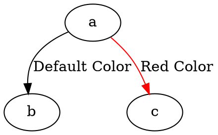

# Color

Specifies the color of the edge. The edge color can be used to highlight or distinguish edges from one another.

**Usage**:

Dot



Java

```dot
Node a = Node.builder().id("a").build();
Node b = Node.builder().id("b").build();
Node c = Node.builder().id("c").build();

Line defaultColor = Line.builder(a, b)
    .label("Default Color")
    .build();

Line redColor = Line.builder(a, c)
    .label("Red Color")
    .color(Color.RED)
    .build();

Graphviz graph = Graphviz.digraph()
    .addLine(defaultColor)
    .addLine(redColor)
    .build();
```

Color detail see [Color Intro](../Color Intro)