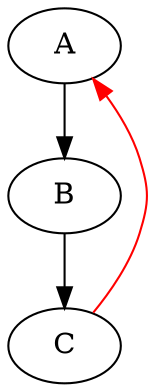
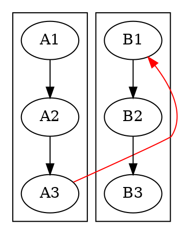
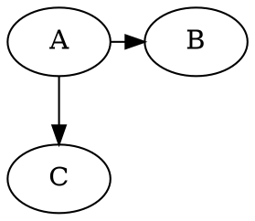

# Constraint

The `constraint` attribute controls whether an edge participates in hierarchical rank assignment in
the DOT and DOTQ layout engines.

The default is `true`.

This attribute follows the [Graphviz constraint semantics](https://graphviz.org/docs/attrs/constraint/)
and is valid on edges.

## Behavior

With `constraint=false`, the edge does not force its head and tail into different ranks. The edge is
still retained for crossing minimization, coordinate assignment, labels, ports, routing, clipping,
arrowheads, and the final `DrawGraph`.

This is different from `minlen=0`: a zero-minlen edge still participates in rank assignment, while a
non-constraining edge is excluded from the rank constraint system entirely.

| Layout | Behavior |
|---|---|
| `DOT` | `constraint=false` excludes the edge from rank assignment |
| `DOTQ` | same behavior as DOT |
| `FDP` | value is retained, but does not change the force-directed layout |
| `JFDP` | value is retained, but does not change the force-directed layout |
| `GFDP` | value is retained, but does not change the force-directed layout |

For force-directed layouts, the edge itself is not ignored: it still participates in the normal
force model and is routed and rendered. Only the `constraint` value has no special effect, matching
the Graphviz behavior where this attribute is dot-only.

## DOT



`A -> B -> C` determines the hierarchy. `C -> A` is routed as a visible feedback edge without
changing those ranks.

The difference is especially visible for independent pipelines:



With `constraint=false`, `A1/B1`, `A2/B2`, and `A3/B3` can remain on matching ranks. Changing the
value to `true` forces `B1 -> B2 -> B3` below `A1 -> A2 -> A3`.

An edge default can be inherited and overridden:



Only case-insensitive `true` and `false` are accepted as boolean values. An invalid value such as
`constraint=true1` is ignored, leaving the property unset and therefore using the default `true`.

## Java

```java
Line feedback = Line.builder(c, a)
    .constraint(false)
    .color(Color.RED)
    .build();
```

The effective value is available through:

```java
Boolean constraint = feedback.lineAttrs().getConstraint();
```

`null` means the default behavior (`true`). Line templates can provide a default, and a concrete
line can explicitly override it:

```java
Graphviz graph = Graphviz.digraph()
    .tempLine(Line.tempLine().constraint(false).build())
    .addLine(Line.builder(a, b).build())
    .addLine(Line.builder(a, c).constraint(true).build())
    .build();
```

## Interactions with other edge attributes

- `minlen` and `weight` do not reintroduce a rank constraint when `constraint=false`.
- `tailPort`, `headPort`, `tailCell`, and `headCell` still control the routed endpoints.
- Edge labels and floating labels are still positioned normally.
- `headclip`, `tailclip`, direction, arrow shapes, and arrow sizes are still applied.
- Parallel edges, self-loops, clusters, nested clusters, `lhead`, and `ltail` remain part of routing
  and rendering.
- The edge continues to participate in crossing minimization and coordinate assignment after ranks
  have been assigned.
