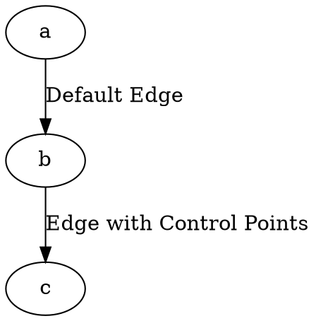

# ControlPoints

The **controlPoints** attribute allows **visualizing all routing points** along an edge. When enabled, it displays **intermediate points** used in **edge path calculation**, whether the edge is **straight or curved**.

------

## **Behavior**

- **`controlPoints = true`** → Displays all **intermediate routing points** along the edge.
- **`controlPoints = false`** (default) → Only renders the **final path** without visible control points.

## Examples

Dot



Java

```java
Node a = Node.builder().id("a").build();
Node b = Node.builder().id("b").build();
Node c = Node.builder().id("c").build();

// Standard edge without control points
Line defaultEdge = Line.builder(a, b)
    .label("Default Edge")
    .build();

// Edge with control points enabled
Line controlEdge = Line.builder(b, c)
    .label("Edge with Control Points")
    .controlPoints(true) // Enables control point visualization
    .build();

Graphviz graph = Graphviz.digraph()
    .addLine(defaultEdge, controlEdge)
    .build();
```

✅ **`.controlPoints(true)`** → Enables **control point visualization** along the edge.