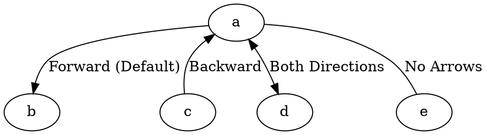

# Dir

The **dir** attribute controls the **directionality of edges** in **directed graphs (`digraph`)**. It determines whether an edge has **a single arrow**, **double arrows**, or **no arrows at all**.

------

## **Behavior**

- **Applies only to directed graphs (`digraph`)**.
- **If omitted, edges default to `"forward"` (arrow at the head node)**.
- **Different `dir` values control the presence and position of arrows on edges**.
- **Works with `arrowhead`, `arrowtail`, and `arrowsize` attributes for full customization**.

------

## **Supported Dir Values**

| **Dir Value** | **Effect**                                             | **Example DOT Code**    |
| ------------- | ------------------------------------------------------ | ----------------------- |
| `forward`     | Default behavior: arrow at the head (destination) node | `a -> b [dir=forward];` |
| `back`        | Arrow at the tail (source) node                        | `a -> b [dir=back];`    |
| `both`        | Arrows at both ends (tail and head)                    | `a -> b [dir=both];`    |
| `none`        | No arrows on the edge                                  | `a -> b [dir=none];`    |

------

## **Usage in DOT**



### **Explanation**

- **`a -> b [dir=forward]`** → **Default behavior**, arrow at the head node.
- **`a -> c [dir=back]`** → Arrow at the **tail (source) node** instead of the head.
- **`a -> d [dir=both]`** → Arrows at **both ends** of the edge.
- **`a -> e [dir=none]`** → **No arrows**, making the edge appear as an **undirected** connection.

------

## **Usage in Java**

```java
Node a = Node.builder().id("a").build();
Node b = Node.builder().id("b").build();
Node c = Node.builder().id("c").build();
Node d = Node.builder().id("d").build();
Node e = Node.builder().id("e").build();

// Default direction (arrow at head)
Line forwardEdge = Line.builder(a, b)
    .label("Forward (Default)")
    .dir(Dir.FORWARD) // Default arrow at the head
    .build();

// Backward direction (arrow at the tail)
Line backwardEdge = Line.builder(a, c)
    .label("Backward")
    .dir(Dir.BACK) // Arrow at the tail
    .build();

// Bidirectional (arrows at both ends)
Line bothDirectionsEdge = Line.builder(a, d)
    .label("Both Directions")
    .dir(Dir.BOTH) // Arrows at both ends
    .build();

// No arrows
Line noArrowsEdge = Line.builder(a, e)
    .label("No Arrows")
    .dir(Dir.NONE) // No arrows on the edge
    .build();

Graphviz graph = Graphviz.digraph()
    .addLine(forwardEdge)
    .addLine(backwardEdge)
    .addLine(bothDirectionsEdge)
    .addLine(noArrowsEdge)
    .build();
```

