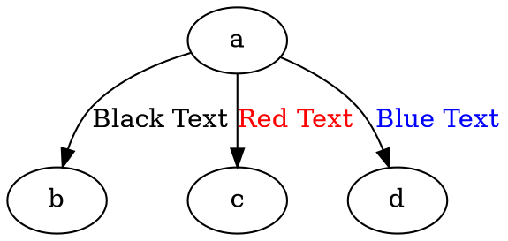

### **Font Color**

The **font color** controls the color of the edge label.

------

## Examples

Dot



Java

```java
Node a = Node.builder().id("a").build();
Node b = Node.builder().id("b").build();
Node c = Node.builder().id("c").build();
Node d = Node.builder().id("d").build();

// Edge with black font color
Line blackTextEdge = Line.builder(a, b)
    .label("Black Text")
    .fontColor(Color.BLACK) // Black text color
    .build();

// Edge with red font color
Line redTextEdge = Line.builder(a, c)
    .label("Red Text")
    .fontColor(Color.RED) // Red text color
    .build();

// Edge with blue font color
Line blueTextEdge = Line.builder(a, d)
    .label("Blue Text")
    .fontColor(Color.BLUE) // Blue text color
    .build();

Graphviz graph = Graphviz.digraph()
    .addLine(blackTextEdge)
    .addLine(redTextEdge)
    .addLine(blueTextEdge)
    .build();
```