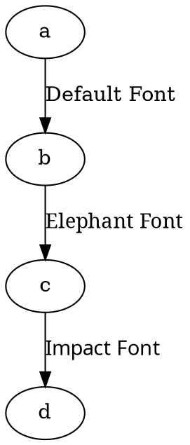

# Font Name

The **font name** controls the typeface used for edge label.

## Examples:

Dot



Java

```java
Node a = Node.builder().id("a").build();
Node b = Node.builder().id("b").build();
Node c = Node.builder().id("c").build();
Node d = Node.builder().id("d").build();

// Edge with default font
Line defaultFontEdge = Line.builder(a, b)
    .label("Default Font") // Uses the default font
    .build();

// Edge with "Elephant" font
Line elephantFontEdge = Line.builder(b, c)
    .label("Elephant Font")
    .fontName("Elephant") // Sets font name to "Elephant"
    .build();

// Edge with "Impact" font
Line impactFontEdge = Line.builder(c, d)
    .label("Impact Font")
    .fontName("Impact") // Sets font name to "Impact"
    .build();

Graphviz graph = Graphviz.digraph()
    .addLine(defaultFontEdge)
    .addLine(elephantFontEdge)
    .addLine(impactFontEdge)
    .build();
```