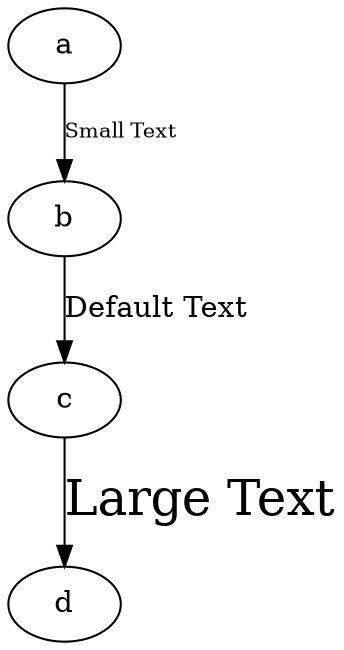

# FontSize 

The **fontsize** attribute sets the **size of the edge label**. Larger values make the text bigger, while smaller values make it smaller.

## Examples:

Dot



- **`fontsize=10`** → Small text size.
- **No `fontsize` specified** → Uses the default size (typically `14`).
- **`fontsize=24`** → Large text size.

Java

```java
Node a = Node.builder().id("a").build();
Node b = Node.builder().id("b").build();
Node c = Node.builder().id("c").build();
Node d = Node.builder().id("d").build();

// Edge with small font size
Line smallTextEdge = Line.builder(a, b)
    .label("Small Text")
    .fontSize(10) // Sets font size to 10
    .build();

// Edge with default font size (typically 14)
Line defaultTextEdge = Line.builder(b, c)
    .label("Default Text") // No font size set, uses default
    .build();

// Edge with large font size
Line largeTextEdge = Line.builder(c, d)
    .label("Large Text")
    .fontSize(24) // Sets font size to 24
    .build();

Graphviz graph = Graphviz.digraph()
    .addLine(smallTextEdge)
    .addLine(defaultTextEdge)
    .addLine(largeTextEdge)
    .build();
```
