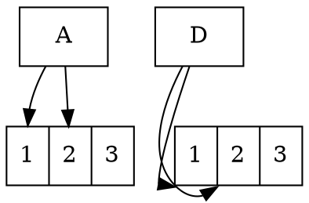

# HeadCell

The **headcell** attribute specifies **which specific field (cell) within a record-shaped node** the edge should terminate at. This allows **precise control over edge routing** when working with **record (`shape=record`) or Mrecord (`shape=Mrecord`)** nodes that use **cell expressions**.

------

## **Behavior**

- **Only works with `shape=record` or `shape=Mrecord` nodes**.
- **Targets a specific cell (field) within the record node**.
- **Equivalent to `a -> b:p1` notation (`a -> b [headcell=p1]` is the same as `a -> b:p1`)**.
- **Can be combined with `headport` for precise edge attachment points**.
- **Improves edge readability by ensuring connections end at the correct field within a node**.

------

## **Usage in DOT**



### **Explanation**

- **`b [label=" 1 | 2 | 3"]`** → Defines a **record-shaped node with a field (`p1`)**.
- **`a -> b:p1`** → Edge **terminates at the `p1` field** inside node `b`.
- **`a -> b [headcell=p1]`** → **Equivalent to `a -> b:p1`**, using the `headcell` attribute.
- **`c -> d:sw:p1`** → Edge terminates at **cell `p1`** at the **southwest (`sw`)** corner of `d`.
- **`c -> d [headcell=p1, headport=sw]`** → Explicit notation for the same behavior.

------

## **Usage in Java**

```java
Node a = Node.builder().id("a").build();

Node b = Node.builder()
    .id("b")
    .shape(NodeShapeEnum.RECORD)
    .label("<p1> 1 | 2 | 3")
    .build();

// Equivalent to "a -> b:p1"
Line toCellP1 = Line.builder(a, b)
    .label("Connects to p1")
    .headCell("p1")  // Targets cell "p1" inside node "b"
    .build();

// Using headcell + headport together
Node c = Node.builder()
    .id("c")
    .shape(NodeShapeEnum.RECORD)
    .label("1 | <p2> 2 | 3")
    .build();

Node d = Node.builder().id("d").build();

Line toCellP1WithPort = Line.builder(d, c)
    .label("Connects to p1 (SW corner)")
    .headCell("p2")  // Targets cell "p1" inside node "d"
    .headPort(Port.SOUTH_WEST)  // Connects to the southwest corner of "d"
    .build();

Graphviz graph = Graphviz.digraph()
    .addLine(toCellP1)
    .addLine(toCellP1WithPort)
    .build();
```