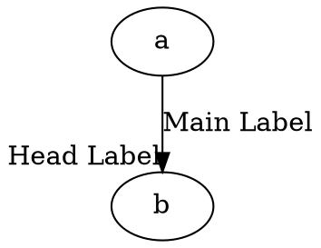

# HeadLabel

The **headlabel** attribute specifies **a label that appears near the head (destination) of an edge**. This is useful for **annotating the end of an edge** with additional information.

------

## **Behavior**

- **Places a label near the head (destination) node of an edge**.
- **Does not affect the position of the main edge label (`label`)**.
- **Works with all Graphviz layout engines**.
- **Can be styled using attributes like `fontcolor`, `fontsize`, and `fontname`**.

------

## **Usage in DOT**



### **Explanation**

- `a -> b [label="Main Label", headlabel="Head Label"]`

  →

  - `"Main Label"` appears **in the middle of the edge**.
  - `"Head Label"` appears **near node `b` (head)**.

------

## **Usage in Java**

The Java API does not support `headlabel` directly; use `FloatLabel` to achieve a similar effect.

```java
Node a = Node.builder().id("a").build();
Node b = Node.builder().id("b").build();

FloatLabel headLabel = FloatLabel.builder()
    .tend(Tend.HEAD)
    .label("Head Label")
    .build();

// Edge with main label and head label
Line edgeWithHeadLabel = Line.builder(a, b)
    .label("Main Label")
    .floatLabels(headLabel)  // Label at the head of the edge
    .build();

Graphviz graph = Graphviz.digraph()
    .addLine(edgeWithHeadLabel)
    .build();
```