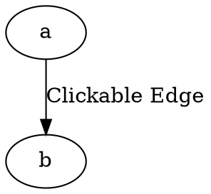

# Href

The **href**  (alias: **url**) attribute adds a **clickable hyperlink** to an edge, making it interactive in `SVG` outputs.

## Examples:

Dot



- **`href="URL"`** → Clicking the edge **opens the link** in `SVG` exports.
- **Works in `svg` formats** but not in plain images (`png`, `jpg` etc).

Java

```java
Node a = Node.builder().id("a").build();
Node b = Node.builder().id("b").build();

Line hrefEdge = Line.builder(a, b)
    .label("Href Edge")
    .href("https://github.com/")
    .build();

Graphviz graph = Graphviz.digraph()
    .addLine(hrefEdge)
    .build();
```

- **`href(String url)`** → Adds a hyperlink to the edge.
- **Works in `svg` formats** but not in plain images (`png`, `jpg` etc).