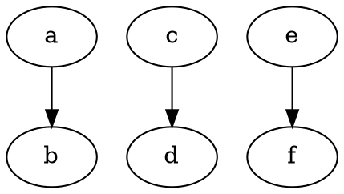

## ID

Sets a unique identifier for the edge. If not specified, it is automatically assigned during rendering.
**Note**: If multiple edges share the same ID, only one will be rendered.

**Usage**:

Dot


Java

```java
// Create individual nodes
Node a = Node.builder().id("a").build();
Node b = Node.builder().id("b").build();
Node c = Node.builder().id("c").build();
Node d = Node.builder().id("d").build();
Node e = Node.builder().id("e").build();
Node f = Node.builder().id("f").build();

// Create edges (lines)
Line edge1 = Line.builder(c, d).id("edge_1").build();
Line edge2 = Line.builder(e, f).id("edge_1").build(); // Duplicate ID, only one edge will be rendered

// Build the Graphviz graph
Graphviz graphviz = Graphviz.digraph()
    .addLine(a, b)  // Simple direct connection
    .addLine(edge1) // Explicitly set edge ID for c -> d
    .addLine(edge2) // Duplicate edge ID, one will be used
    .build();
```

