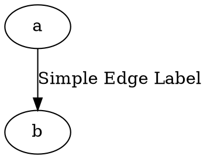
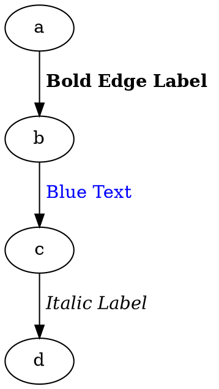
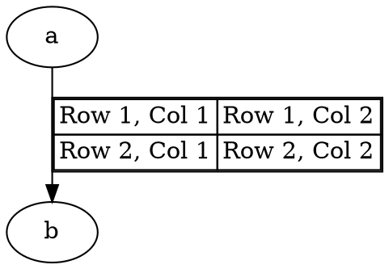

# Edge Label

Defines the **text content** of an **edge**. Edge labels can be **simple strings**, **formatted using LabelTag**, or **structured using tables**.

------

## **Using a Simple Edge Label**

Dot



Java

```java
Node a = Node.builder().id("a").build();
Node b = Node.builder().id("b").build();

Line edge = Line.builder(a, b)
    .label("Simple Edge Label") // Assigns a text label to the edge
    .build();

Graphviz graph = Graphviz.digraph()
    .addLine(edge)
    .build();
```

------

## **Using LabelTag for Rich Text Formatting**

Please see here to check [Lable Tag](../LabelTag.md) detail

Dot



Java using another `labelTag`  method to set:

```java
Node a = Node.builder().id("a").build();
Node b = Node.builder().id("b").build();
Node c = Node.builder().id("c").build();
Node d = Node.builder().id("d").build();

Line boldEdge = Line.builder(a, b)
    .labelTag(bold("Bold Edge Label")) // Bold edge label
    .build();

Line blueEdge = Line.builder(b, c)
    .labelTag(font("Blue Text", fontAttrs().color(Color.BLUE))) // Blue text
    .build();

Line italicEdge = Line.builder(c, d)
    .labelTag(italic("Italic Label")) // Italicized text
    .build();

Graphviz graph = Graphviz.digraph()
    .addLine(boldEdge)
    .addLine(blueEdge)
    .addLine(italicEdge)
    .build();
```

------

## **Using Tables in Edge Labels**

Edge labels support **[tables](../Table.md)**, allowing structured content inside an edge label.

Dot



Java using another `table` method to set

```java
Node a = Node.builder().id("a").build();
Node b = Node.builder().id("b").build();

Line tableEdge = Line.builder(a, b)
    .table(
        table()
            .border(1)
            .cellBorder(1)
            .cellSpacing(0)
            .tr(td().text("Row 1, Col 1"), td().text("Row 1, Col 2"))
            .tr(td().text("Row 2, Col 1"), td().text("Row 2, Col 2"))
    )
    .build();

Graphviz graph = Graphviz.digraph()
    .addLine(tableEdge)
    .build();
```

✅ **Allows table layout inside an edge label**.
 ✅ **Useful for structured information inside edge labels**.