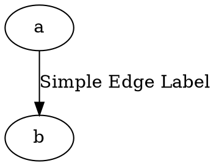
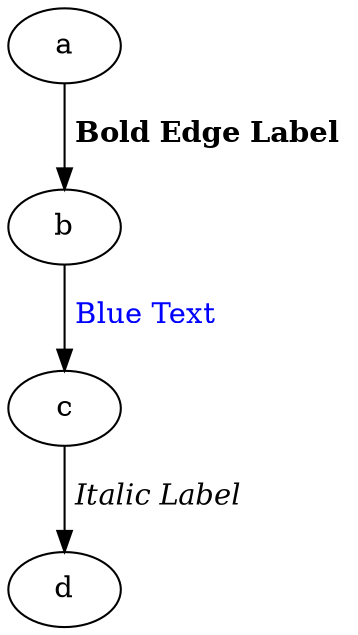
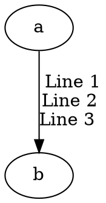
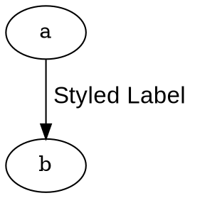
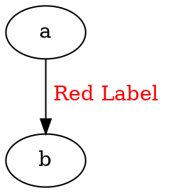
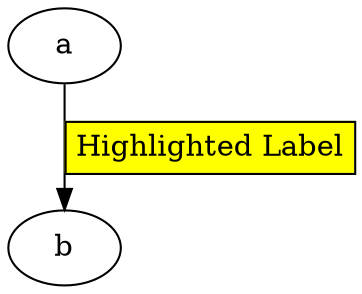

Here is the **updated document focusing only on edge labels**, excluding node labels and **removing Cell Expression support** from edge labels.

------

# **Edge Label**

The **label** attribute in an **edge** defines **text content** that appears **along the edge line**. Edge labels can be **simple text** or **formatted using LabelTag** for rich styling.

------

## **1. Using a Simple Edge Label**

A **plain text label** that appears **along the edge**.

### **Dot**



### **Java**

```java
Node a = Node.builder().id("a").build();
Node b = Node.builder().id("b").build();

Line edge = Line.builder(a, b)
    .label("Simple Edge Label") // Assigns a text label to the edge
    .build();

Graphviz graph = Graphviz.digraph()
    .addNode(a, b)
    .addLine(edge)
    .build();
```

✅ **`label("Text")`** → Defines a **plain text** edge label.

------

## **2. Using Rich Formatting with LabelTag**

For **styled text** on edges, use **LabelTag**, which supports **bold, italics, underline, colors, and font styles**.

### **Dot**



### **Java**

```java
Node a = Node.builder().id("a").build();
Node b = Node.builder().id("b").build();
Node c = Node.builder().id("c").build();
Node d = Node.builder().id("d").build();

Line boldEdge = Line.builder(a, b)
    .labelTag(bold("Bold Edge Label")) // Bold edge label
    .build();

Line blueEdge = Line.builder(b, c)
    .labelTag(font("Blue Text", fontAttrs().color(Color.BLUE))) // Blue text
    .build();

Line italicEdge = Line.builder(c, d)
    .labelTag(italic("Italic Label")) // Italicized text
    .build();

Graphviz graph = Graphviz.digraph()
    .addNode(a, b, c, d)
    .addLine(boldEdge, blueEdge, italicEdge)
    .build();
```

✅ **Supports rich text formatting** (bold, italic, font color).
 ✅ **Use `labelTag()` instead of `label()` for advanced styles.**

------

## **3. Edge Labels with Multi-Line Support**

To display **multi-line edge labels**, use ` ` in **LabelTag**.

### **Dot**



### **Java**

```java
Node a = Node.builder().id("a").build();
Node b = Node.builder().id("b").build();

Line multilineEdge = Line.builder(a, b)
    .labelTag(text("Line 1").br().text("Line 2").br().text("Line 3"))
    .build();

Graphviz graph = Graphviz.digraph()
    .addNode(a, b)
    .addLine(multilineEdge)
    .build();
```

✅ **`br()`** → Inserts a line break (` ` in DOT format).

------

## **4. Edge Labels with Font Size & Face**

Use **LabelTag** to change **font size and typeface**.

### **Dot**



### **Java**

```java
Line styledEdge = Line.builder(a, b)
    .labelTag(font("Styled Label", fontAttrs().pointSize(16).face("Arial")))
    .build();
```

✅ **`fontAttrs()`** → Controls **size, color, and font face**.

------

## **5. Edge Labels with Color**

Use **font color styling** to make edge labels more readable.

### **Dot**



### **Java**

```java
Line redEdge = Line.builder(a, b)
    .labelTag(font("Red Label", fontAttrs().color(Color.RED)))
    .build();
```

✅ **Changes label text color while keeping other styles intact.**

------

## **6. Edge Labels with Background Color**

Although edge labels don't directly support **background color**, you can simulate it using a **colored table**.

### **Dot**



### **Java**

```java
Line highlightedEdge = Line.builder(a, b)
    .labelTag(
        table()
            .bgColor(Color.YELLOW)
            .tr(td().text("Highlighted Label"))
    )
    .build();
```

✅ **Simulates a background color for the edge label using a table.**

------

## **Summary**

| Label Type                | Java Method                                                  | Supports Formatting? | Supports Multi-Line? |
| ------------------------- | ------------------------------------------------------------ | -------------------- | -------------------- |
| **Plain Text**            | `label("Text")`                                              | ❌ No                 | ❌ No                 |
| **Bold/Italic/Underline** | `labelTag(bold("Text"))`                                     | ✅ Yes                | ✅ Yes                |
| **Font Size & Face**      | `labelTag(font("Text", fontAttrs().pointSize(16).face("Arial")))` | ✅ Yes                | ✅ Yes                |
| **Text Color**            | `labelTag(font("Red Text", fontAttrs().color(Color.RED)))`   | ✅ Yes                | ✅ Yes                |
| **Background Color**      | `labelTag(table().bgColor(Color.YELLOW).tr(td().text("Label")))` | ✅ Yes (via table)    | ✅ Yes                |

------

This **updated document** now focuses **exclusively on edge labels** with **simple text and rich formatting**, while **removing unsupported Cell Expressions**. 🚀