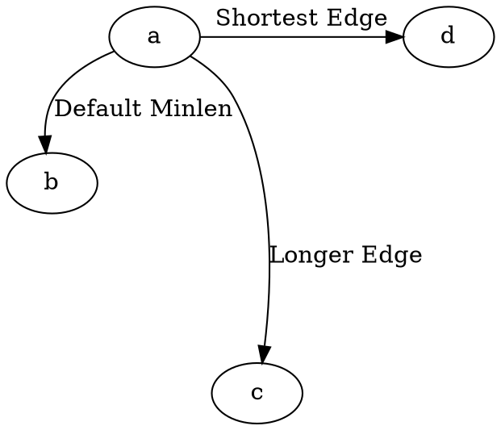

# MinLen

The **minlen** attribute controls the **minimum number of ranks (steps) an edge must span** in the **DOT layout engine**. Increasing **minlen** forces an edge to be **longer**, while reducing it allows edges to be **shorter**.

------

## **Behavior**

- **Applies only in the DOT layout engine** (ignored in `neato`, `fdp`, `sfdp`, `circo`).
- **Higher `minlen` values** → Force longer edges (spanning more ranks).
- **Lower `minlen` values** → Allow shorter edges (spanning fewer ranks).
- **Default value = 1** (edge spans at least one rank).

------

## **Usage in DOT**



### **Explanation**

- **`a -> b`** → Uses **default minlen** (`minlen=1`), meaning it takes **one rank**.
- **`a -> c`** → **Forces the edge to be longer** (`minlen=3`), making it span **three ranks**.
- **`a -> d`** → Explicitly sets **`minlen=0`**, ensuring the **shortest allowed edge**.

⚠ **Important:**

- The **actual edge length** may be longer due to node sizes and layout constraints.
- **Minlen does not define pixel or point length; it defines rank spacing in the DOT engine.**

------

## **Usage in Java**

```java
Node a = Node.builder().id("a").build();
Node b = Node.builder().id("b").build();
Node c = Node.builder().id("c").build();
Node d = Node.builder().id("d").build();

// Default minlen (1)
Line defaultEdge = Line.builder(a, b)
    .label("Default Minlen")
    .build();

// Longer edge (forced to span at least 3 ranks)
Line longEdge = Line.builder(a, c)
    .label("Longer Edge")
    .minlen(3) // Forces the edge to span at least 3 ranks
    .build();

// Shortest edge (1 rank, default behavior)
Line shortEdge = Line.builder(a, d)
    .label("Shortest Edge")
    .minlen(0) // Ensures the edge is as short as possible
    .build();

Graphviz graph = Graphviz.digraph()
    .addLine(defaultEdge)
    .addLine(longEdge)
    .addLine(shortEdge)
    .build();
```