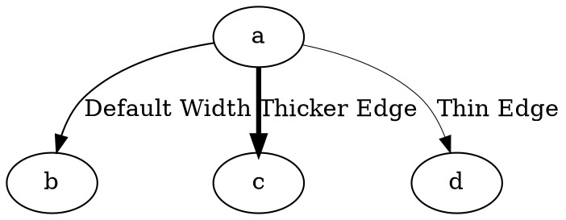

# PenWidth

The **penwidth** attribute controls the **thickness (stroke width) of an edge** in Graphviz. This allows **emphasizing certain edges** by making them thicker or de-emphasizing them by making them thinner.

------

## **Behavior**

- **Larger values increase edge thickness** (e.g., `penwidth=3` makes the edge thicker).
- **Smaller values decrease edge thickness** (e.g., `penwidth=0.5` makes the edge very thin).
- **Default value is `1.0`**, which is the normal thickness.
- **Works in all Graphviz layout engines**.
- **Affects only the edge stroke; arrowheads are not scaled** (for arrowhead size, use `arrowsize`).

------

## **Usage in DOT**



### **Explanation**

- **`a -> b`** → Uses the **default penwidth** (`1.0`), standard thickness.
- **`a -> c [penwidth=3]`** → Increases **thickness to 3**, making the edge bold.
- **`a -> d [penwidth=0.5]`** → Decreases **thickness to 0.5**, making the edge very thin.

------

## **Usage in Java**

```java
Node a = Node.builder().id("a").build();
Node b = Node.builder().id("b").build();
Node c = Node.builder().id("c").build();
Node d = Node.builder().id("d").build();

// Default penwidth (1.0)
Line defaultWidth = Line.builder(a, b)
    .label("Default Width")
    .build();

// Thicker edge (penwidth=3)
Line thickEdge = Line.builder(a, c)
    .label("Thicker Edge")
    .penWidth(3.0)  // Increase stroke width
    .build();

// Thinner edge (penwidth=0.5)
Line thinEdge = Line.builder(a, d)
    .label("Thin Edge")
    .penWidth(0.5)  // Decrease stroke width
    .build();

Graphviz graph = Graphviz.digraph()
    .addLine(defaultWidth)
    .addLine(thickEdge)
    .addLine(thinEdge)
    .build();
```