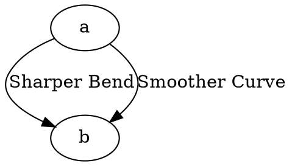

# Radian

The **radian** attribute controls **how smoothly an edge transitions** between routing points when using **`splines=rounded`**. It determines the **curvature radius** at each corner, making edges appear **sharper or smoother**.

------

## **Behavior**

- **Works only when `splines=rounded`**.
- **Higher values** → **Smoother curves** (gentle transitions).
- **Lower values** → **Sharper bends** (closer to a polyline shape).
- **Default value** is **automatically calculated** based on routing.

------

## **Usage in DOT**



### **Explanation**

- **`a -> b [radian=0.2]`** → Produces a **sharp bend** at routing points.
- **`a -> b [radian=15]`** → Creates a **very smooth curve** between routing points.

✅ **Higher radian values** allow edges to **flow naturally**.
 ✅ **Lower radian values** keep edges **tighter and closer to polylines**.

------

## **Usage in Java**

```java
Node a = Node.builder().id("a").build();
Node b = Node.builder().id("b").build();

// Edge with a sharp bend
Line sharpBendEdge = Line.builder(a, b)
    .label("Sharper Bend")
    .radian(0.2) // Creates a sharper transition
    .build();

// Edge with a smoother curve
Line smoothCurveEdge = Line.builder(a, b)
    .label("Smoother Curve")
    .radian(15) // Makes a very smooth curve
    .build();

Graphviz graph = Graphviz.digraph()
    .splines(Splines.ROUNDED) // Must be "rounded" for radian to work
    .addLine(sharpBendEdge)
    .addLine(smoothCurveEdge)
    .build();
```

✅ **`.radian(double value)`** → Controls **how smoothly the curve bends**.