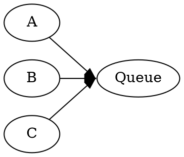

# SameHead

The `samehead` edge attribute groups edges that have the same logical head node and group value.
Groups with at least two non-loop edges are assigned one shared point on the head shape boundary.



The point is selected from the average normalized direction between the head node center and the
opposite endpoint node centers, then clipped against the actual head shape.

```java
Line line = Line.builder(a, queue)
    .sameHead("in")
    .build();
```

Port, clipping, loop, router, and layout-engine behavior matches [SameTail](SameTail.md).
