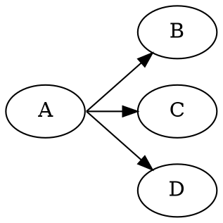

# SameTail

The `sametail` edge attribute groups edges that have the same logical tail node and group value.
Groups with at least two non-loop edges are assigned one shared point on the tail shape boundary.



The point is chosen after coordinate assignment. For every edge in the group, the normalized
direction from the tail node center to the opposite node center is calculated. These directions are
averaged, and the resulting ray is clipped against the actual tail shape.

```java
Line line = Line.builder(a, b)
    .sameTail("out")
    .build();
```

Notes:

- The group key is the tail node plus the `sametail` string; equal strings on different nodes form
  different groups.
- Explicit cell/compass ports and `tailclip` values are replaced by the shared boundary point, as in
  Graphviz.
- Compound cluster clipping still applies after the shared node point is selected.
- Self-loops and one-edge groups are ignored.
- DOT and DOTQ support this behavior for spline, rounded, polyline, and line routing.
- ORTHO accepts the attribute but does not force a shared point, matching Graphviz's practical
  behavior.
- FDP, JFDP, and GFDP retain the attribute without applying DOT same-port semantics.

See also [SameHead](SameHead.md).
