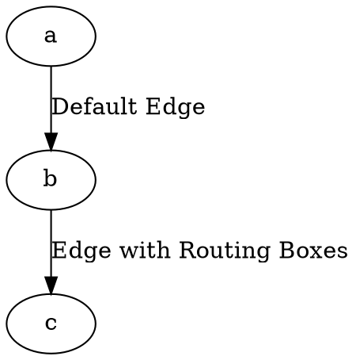

# ShowBoxes

The **showBoxes** attribute enables visualization of the **bounding boxes** used in **edge routing calculations** when the **splines** attribute is set to `spline`, `rounded`, or `polyline`.

------

## **Behavior**

- **`showBoxes = true`** → Displays all **bounding boxes** used for edge routing.
- **`showBoxes = false`** (default) → Does not display routing boxes.
- Works only when **`splines` is set to `spline`, `rounded`, or `polyline`**.

------

## **Usage in DOT**



### **Explanation**

- **`a -> b`** → Standard edge without routing boxes.
- **`b -> c`** → Edge with **`showBoxes=true`**, displaying **all routing boxes** used in the edge path computation.

------

## **Usage in Java**

```java
Node a = Node.builder().id("a").build();
Node b = Node.builder().id("b").build();
Node c = Node.builder().id("c").build();

// Standard edge without routing boxes
Line defaultEdge = Line.builder(a, b)
    .label("Default Edge")
    .build();

// Edge with routing boxes visualization enabled
Line boxEdge = Line.builder(b, c)
    .label("Edge with Routing Boxes")
    .showboxes(true) // Enables visualization of routing boxes
    .build();

Graphviz graph = Graphviz.digraph()
    .splines(Splines.POLYLINE) // Ensure splines is set to "spline", "rounded", or "polyline"
    .addLine(defaultEdge)
    .addLine(boxEdge)
    .build();
```

✅ **`.showBoxes(true)`** → Enables **visualization of all bounding boxes** used in edge routing.