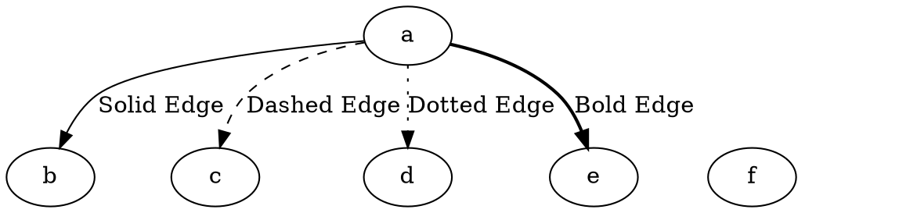

# Style

The **edge style** controls how edges are rendered in the graph. Different styles allow for **dashed**, **dotted**, **bold**, or **invisible** edges, helping to visually distinguish different types of relationships.

------

## **Supported Edge Styles**

| **Style** | **Effect**                               | **Example DOT Code**     |
| --------- | ---------------------------------------- | ------------------------ |
| `SOLID`   | Default solid edge                       | `a -> b [style=solid];`  |
| `DASHED`  | Dashed line                              | `a -> b [style=dashed];` |
| `DOTTED`  | Dotted line                              | `a -> b [style=dotted];` |
| `BOLD`    | Thick, bold line                         | `a -> b [style=bold];`   |
| `INVIS`   | Invisible edge (used for layout control) | `a -> b [style=invis];`  |

------

## **Usage in DOT**



### **Explanation**

- **`a -> b [style=solid]`** → Default **solid edge** (no need to specify explicitly).
- **`a -> c [style=dashed]`** → Dashed edge, useful for weak relationships.
- **`a -> d [style=dotted]`** → Dotted edge, often used for auxiliary or optional links.
- **`a -> e [style=bold]`** → Bold edge, useful for emphasizing important connections.
- **`a -> f [style=invis]`** → Invisible edge, often used **to control node layout without displaying a visible edge**.

------

## **Usage in Java**

```java
Node a = Node.builder().id("a").build();
Node b = Node.builder().id("b").build();
Node c = Node.builder().id("c").build();
Node d = Node.builder().id("d").build();
Node e = Node.builder().id("e").build();
Node f = Node.builder().id("f").build();

// Solid edge (default)
Line solidEdge = Line.builder(a, b)
    .label("Solid Edge")
    .style(LineStyle.SOLID) // Default solid line
    .build();

// Dashed edge
Line dashedEdge = Line.builder(a, c)
    .label("Dashed Edge")
    .style(LineStyle.DASHED) // Dashed line
    .build();

// Dotted edge
Line dottedEdge = Line.builder(a, d)
    .label("Dotted Edge")
    .style(LineStyle.DOTTED) // Dotted line
    .build();

// Bold edge
Line boldEdge = Line.builder(a, e)
    .label("Bold Edge")
    .style(LineStyle.BOLD) // Bold line
    .build();

// Invisible edge (used for layout control)
Line invisibleEdge = Line.builder(a, f)
    .label("Invisible Edge")
    .style(LineStyle.INVIS) // Invisible line
    .build();

Graphviz graph = Graphviz.digraph()
    .addLine(solidEdge)
    .addLine(dashedEdge)
    .addLine(dottedEdge)
    .addLine(boldEdge)
    .addLine(invisibleEdge)
    .build();
```