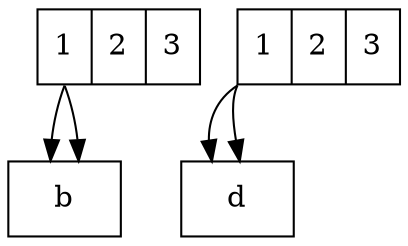

# TailCell

The **tailcell** attribute specifies **which specific field (cell) within a record-shaped node** the edge should originate from. This allows **precise control over edge routing** when working with **record (`shape=record`) or Mrecord (`shape=m_record`)** nodes that use **cell expressions**.

------

## **Behavior**

- **Only works with `shape=record` or `shape=Mrecord` nodes**.
- **Targets a specific cell (field) within the record node**.
- **Equivalent to `a:p1 -> b` notation (`a -> b [tailcell=p1]` is the same as `a:p1 -> b`)**.
- **Can be combined with `tailport` for precise edge attachment points**.
- **Improves edge readability by ensuring connections start from the correct field within a node**.

------

## **Usage in DOT**



### **Explanation**

- **`a [label=" 1 | 2 | 3"]`** → Defines a **record-shaped node with a field (`p1`)**.
- **`a:p1 -> b`** → Edge originates from the **`p1` field** inside node `a`.
- **`a -> b [tailcell=p1]`** → **Equivalent to `a:p1 -> b`**, using the `tailcell` attribute.
- **`c:sw:p1 -> d`** → Edge originates from **cell `p1`** at the **southwest (`sw`)** corner of `c`.
- **`c -> d [tailcell=p1, tailport=sw]`** → Explicit notation for the same behavior.

------

## **Usage in Java**

```java
Node a = Node.builder()
    .id("a")
    .shape(NodeShapeEnum.RECORD)
    .label("<p1> 1 | 2 | 3")
    .build();

Node b = Node.builder().id("b").build();

// Equivalent to "a:p1 -> b"
Line fromCellP1 = Line.builder(a, b)
    .tailCell("p1")  // Targets cell "p1" inside node "a"
    .build();

// Using tailcell + tailport together
Node c = Node.builder()
    .id("c")
    .shape(NodeShapeEnum.RECORD)
    .label("<p1> 1 | 2 | 3")
    .build();

Node d = Node.builder().id("d").build();

Line fromCellP1WithPort = Line.builder(c, d)
    .label("Connects from p1 (SW corner)")
    .tailCell("p1")  // Targets cell "p1" inside node "c"
    .tailPort(Port.SOUTH_WEST)  // Connects from the southwest corner of "c"
    .build();

Graphviz graph = Graphviz.digraph()
    .addLine(fromCellP1)
    .addLine(fromCellP1WithPort)
    .build();
```