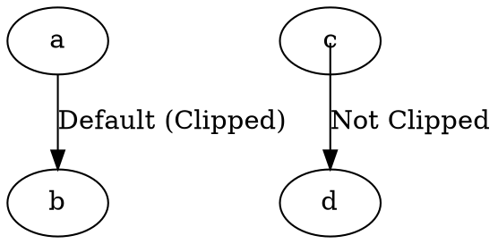

# TailCilp

The **tailclip** attribute controls whether an edge **clips at the boundary of the tail node** (the source node) or extends **inside the node shape**.

------

## **Behavior**

- **`tailclip=true` (default)** → The edge stops at the **boundary of the tail node**.
- **`tailclip=false`** → The edge extends **inside the tail node**, connecting directly to its center.

------

## **Usage in DOT**



### **Explanation**

- **`a -> b`** → Default behavior (**tailclip=true**), edge **stops at the boundary** of node `a`.
- **`c -> d`** → Edge extends **inside** node `c` (**tailclip=false**).

------

## **Usage in Java**

```java
Node a = Node.builder().id("a").build();
Node b = Node.builder().id("b").build();
Node c = Node.builder().id("c").build();
Node d = Node.builder().id("d").build();

// Default behavior (clipped at the tail node boundary)
Line defaultEdge = Line.builder(a, b)
    .label("Default (Clipped)")
    .build();

// Edge extends inside the tail node
Line unclippedEdge = Line.builder(c, d)
    .label("Not Clipped")
    .tailclip(false) // Allows the edge to extend inside the source node
    .build();

Graphviz graph = Graphviz.digraph()
    .addLine(defaultEdge)
    .addLine(unclippedEdge)
    .build();
```