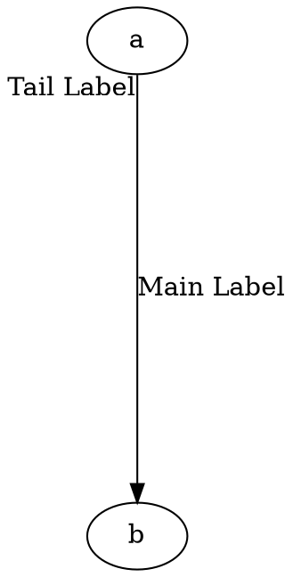
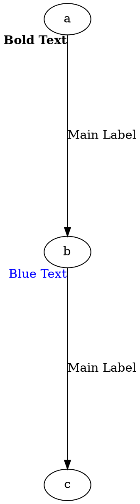
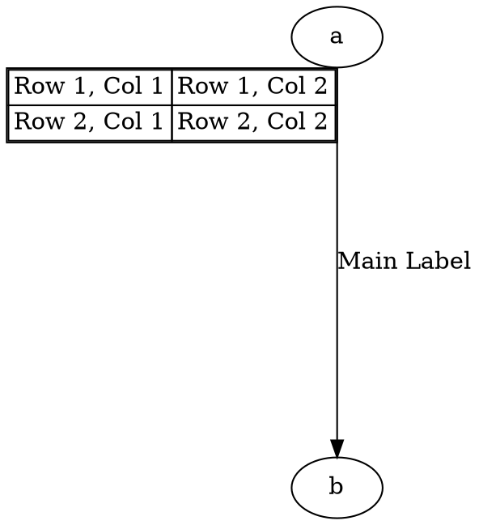

# **Taillabel**

The **taillabel** attribute specifies **a label that appears near the tail (source) of an edge**. This is useful for **annotating the start of an edge** with additional information. Additionally, **`taillabel` supports HTML tags** and **tables** for rich text formatting and structured content.

------

## **Behavior**

- **Places a label near the tail (source) node of an edge**.
- **Does not affect the position of the main edge label (`label`)**.
- **Works with all layout engines**.
- **Supports HTML-like tags** and **tables** for rich formatting and structured labels.

------

## **Usage in DOT**

### **Basic Usage: Tail Label**



### **Using HTML Formatting in `taillabel`**



### **Using Tables in `taillabel`**



------

## **Usage in Java**

### **Basic Usage: Tail Label**

```java
Node a = Node.builder().id("a").build();
Node b = Node.builder().id("b").build();

FloatLabel tailLabel = FloatLabel.builder()
    .tend(Tend.TAIL)
    .label("Tail Label")
    .build();

// Edge with main label and tail label
Line edgeWithTailLabel = Line.builder(a, b)
    .label("Main Label")
    .floatLabels(tailLabel)  // Label at the tail of the edge
    .build();

Graphviz graph = Graphviz.digraph()
    .rankSep(2)
    .addLine(edgeWithTailLabel)
    .build();
```

### **Using HTML Formatting in `taillabel`**

```java
Node a = Node.builder().id("a").build();
Node b = Node.builder().id("b").build();

FloatLabel tailLabel = FloatLabel.builder()
    .tend(Tend.TAIL)
    .labelTag(italic(underline("Tail label")))
    .build();

// Edge with main label and tail label
Line edgeWithTailLabel = Line.builder(a, b)
    .label("Main Label")
    .floatLabels(tailLabel)  // Label at the tail of the edge
    .build();

Graphviz graph = Graphviz.digraph()
    .rankSep(2)
    .addLine(edgeWithTailLabel)
    .build();
```

### **Using Tables in `taillabel`**

```java
Node a = Node.builder().id("a").build();
Node b = Node.builder().id("b").build();

FloatLabel tailLabel = FloatLabel.builder()
    .tend(Tend.TAIL)
    .table(
        table()
            .border(1)
            .cellBorder(1)
            .cellSpacing(0)
            .tr(td().text("Row 1, Col 1"), td().text("Row 1, Col 2"))
            .tr(td().text("Row 2, Col 1"), td().text("Row 2, Col 2"))
    )
    .build();

// Edge with main label and tail label
Line edgeWithTailLabel = Line.builder(a, b)
    .label("Main Label")
    .floatLabels(tailLabel)  // Label at the tail of the edge
    .build();

Graphviz graph = Graphviz.digraph()
    .rankSep(2)
    .addLine(edgeWithTailLabel)
    .build();
```