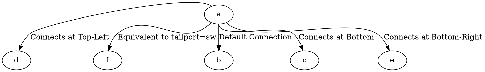

# TailPort

The **tailport** attribute specifies **which part of the source (tail) node** the edge should connect to. This provides fine-grained control over **how edges attach to nodes**, especially when using **record-shaped nodes** or **non-circular node shapes**.

------

## **Behavior**

- **Determines which part of the tail (source) node the edge should attach to**.
- **Equivalent to using `node:port` notation (`a:sw -> b` is the same as `a -> b [tailport=sw]`)**.
- **Works best with nodes that have distinct ports (e.g., `record`, `Mrecord`, or non-circular shapes)**.
- **Improves edge routing and graph readability**.

------

## **Available Ports for Tail Connection**

| **Port** | **Description**                                     | **Example DOT Code**    |
| -------- | --------------------------------------------------- | ----------------------- |
| `n`      | Connects at the **top** (north) of the node         | `a -> b [tailport=n];`  |
| `s`      | Connects at the **bottom** (south) of the node      | `a -> b [tailport=s];`  |
| `e`      | Connects at the **right** (east) of the node        | `a -> b [tailport=e];`  |
| `w`      | Connects at the **left** (west) of the node         | `a -> b [tailport=w];`  |
| `ne`     | Connects at the **top-right corner** (northeast)    | `a -> b [tailport=ne];` |
| `nw`     | Connects at the **top-left corner** (northwest)     | `a -> b [tailport=nw];` |
| `se`     | Connects at the **bottom-right corner** (southeast) | `a -> b [tailport=se];` |
| `sw`     | Connects at the **bottom-left corner** (southwest)  | `a -> b [tailport=sw];` |

⚠ **Note:** `tailport` only affects the **tail (source) node**. Use **`headport`** to control the connection point at the **destination (head) node**.

------

## **Usage in DOT**



### **Explanation**

- **`a -> b`** → Uses **default connection** (typically center of node).
- **`a -> c [tailport=s]`** → Edge **originates from the bottom** of `a`.
- **`a -> d [tailport=nw]`** → Edge **originates from the top-left corner** of `a`.
- **`a -> e [tailport=se]`** → Edge **originates from the bottom-right corner** of `a`.
- **`a:sw -> f`** → **Equivalent to `a -> f [tailport=sw]`**, edge originates from bottom-left.

------

## **Usage in Java**

```java
Node a = Node.builder().id("a").build();
Node b = Node.builder().id("b").build();
Node c = Node.builder().id("c").build();
Node d = Node.builder().id("d").build();
Node e = Node.builder().id("e").build();

// Default connection (center)
Line defaultEdge = Line.builder(a, b)
    .label("Default Connection")
    .build();

// Connects at bottom (south)
Line bottomEdge = Line.builder(a, c)
    .label("Connects at Bottom")
    .tailPort(Port.SOUTH) // Connects at bottom of tail node
    .build();

// Connects at top-left (northwest)
Line topLeftEdge = Line.builder(a, d)
    .label("Connects at Top-Left")
    .tailPort(Port.NORTH_WEST) // Connects at top-left of tail node
    .build();

// Connects at bottom-right (southeast)
Line bottomRightEdge = Line.builder(a, e)
    .label("Connects at Bottom-Right")
    .tailPort(Port.SOUTH_EAST) // Connects at bottom-right of tail node
    .build();

Graphviz graph = Graphviz.digraph()
    .addLine(defaultEdge)
    .addLine(bottomEdge)
    .addLine(topLeftEdge)
    .addLine(bottomRightEdge)
    .build();
```