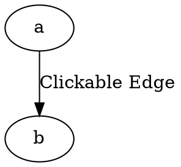

# Tooltip 

The **tooltip** attribute defines **hover text**, but it only works when the edge has an **href (clickable link)** and is rendered in **SVG format**.

## Examples:

Dot



- **`tooltip="text"`** → Displays hover text **only if `href` is set**.
- **Works only in SVG output.**

Java

```java
Node a = Node.builder().id("a").build();
Node b = Node.builder().id("b").build();

Line hrefEdge = Line.builder(a, b)
    .label("Href Edge")
    .href("https://github.com/")
    .tooltip("github")
    .build();

Graphviz graph = Graphviz.digraph()
    .addLine(hrefEdge)
    .build();
```

- **`tooltip(String text)`** → Sets hover text, but only works if `href` is also set.
- **Only works in SVG output.**